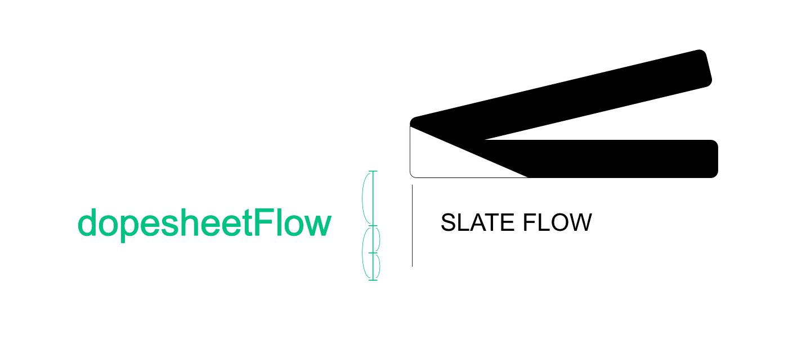

# dopesheetFlow

{: .addon-hero-logo }

**A real light table for Grease Pencil, inside Blender's own Dope Sheet.**

dopesheetFlow turns the Dope Sheet into an "xsheet": every Grease Pencil key
is shown as an actual thumbnail of the drawing, per layer, aligned to
frames, with a hold-duration ruler between instances — the light-table
workflow of Toon Boom, TVPaint or OpenToonz, without ever leaving Blender's
native Dope Sheet.

No new editor: a band is drawn over the existing channel column, with its
own Scene / Summary / group / layer hierarchy, toggled from a button in the
Dope Sheet header.

## At a glance

- **Real thumbnails**, generated by direct GPU rasterization of the Grease
  Pencil strokes (not a full render), with caching and asynchronous
  generation to stay responsive even on dense drawings.
- **Full hierarchy**: a Scene row (composite of every visible GP object), a
  Summary row (composite of one object's layers), groups and layers — each
  with its own composite thumbnail, each independently toggleable.
- **Drag a key** with two modes (trim / ripple), cross-layer and
  cross-group multi-selection, and group-as-parent dragging (moving a
  group's thumbnail moves the real key on every child layer).
- **Alt + hover** for an enlarged floating preview of any thumbnail.
- **Isolate** any row with one click (a real Blender hide, stacking with
  Shift+click across multiple rows).
- **Channel color and keyframe type**, editable right from the overlay.
- **Rename** a layer or group by double-clicking its name.
- **3D viewport scrubbing**: hold a customizable key to bring up a
  thumbnail scrubber near the cursor, without leaving the 3D view.

This guide covers installation, getting started, and every feature in
detail. For a visual walkthrough, see the
**[Features](features.md)** page.

## Why it feels native

dopesheetFlow doesn't introduce a new editor or a parallel data model —
Blender doesn't allow custom editor spaces in Python, and this add-on
doesn't need one. Everything it shows and moves is a real Grease Pencil
layer, group or keyframe. Turn the overlay off from the header button and
the Dope Sheet is exactly Blender's own, channels and all.

## Requirements

- **Blender 5.2 or newer** (Grease Pencil v3 required).

## License

[GNU General Public License v3.0 or later](https://www.gnu.org/licenses/gpl-3.0.html)
— SPDX: `GPL-3.0-or-later`.

dopesheetFlow is part of the **[SlateFlow](../index.md)** suite.
