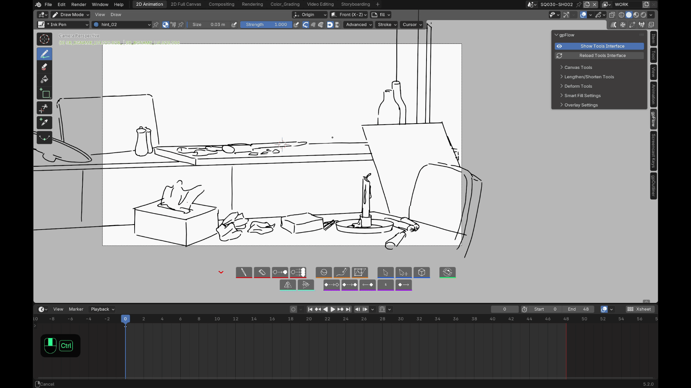
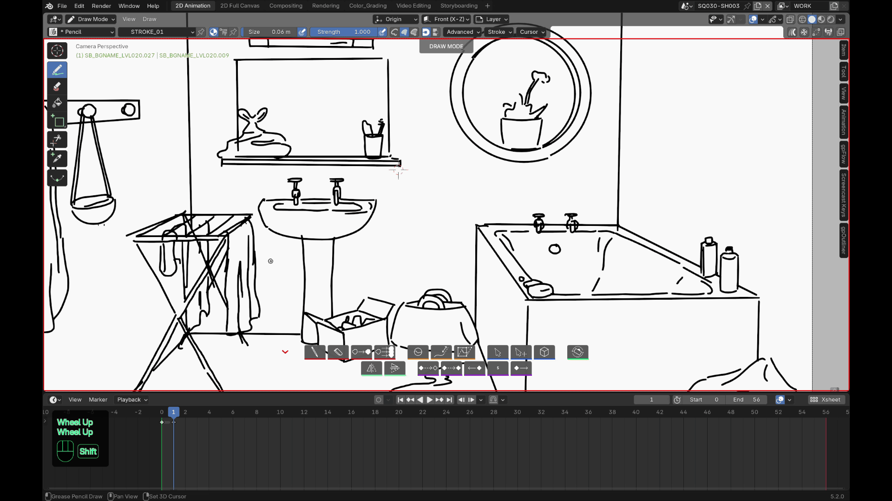

# Features

## Drawing

- **Draw mode** in one click (or via its configured keyboard shortcut),
  with the last brush used for this mode — remembered for the current
  session, not kept across a Blender restart.
- **Erase mode** in one click (or via its configured keyboard shortcut),
  consistent with the other modes.
- **Fill mode** in one click (or via its configured keyboard shortcut) —
  drives Blender's own native Fill tool, so you keep every brush setting
  (extension lines, gap closing...). **Shift+click** removes a fill under
  the cursor, searched across every visible, unlocked layer (not just the
  active one, since a fill lands on whichever layer was active at the
  moment of that click, which may have changed since) — a gesture with no
  native equivalent.

In these three modes, right-click still opens the brush's or the Fill
tool's own native options (direction, settings...) instead of closing the
mode — only **Esc** and **Enter** exit it. Ctrl+Z / Ctrl+Shift+Z undo/redo
without losing the brush you were using.

## Reshape strokes

- **Lengthen/Shorten** — grab a stroke's nearest endpoint, highlighted live
  as you hover, and drag.

The tool stays active after each drag, so you can work through several
strokes in a row without relaunching it (Esc or right-click to exit for
good). The **Lengthen/Shorten Tools** panel in the sidebar controls the
endpoint display (visibility, size) and the detection radius around the
cursor.

- **Deform** drops a view-aligned lattice around your selection — aligned
  at the moment the tool is launched — for quick, natural-looking
  distortion (2D or volumetric, adjustable resolution). Ctrl+click the
  button (or its own dedicated shortcut, independent from the base Deform
  shortcut and remappable in Preferences) to build that lattice straight
  from a selection you already made, instead of selecting again once
  inside the tool.

The **Deform Tools** panel sets the lattice's alignment axis, 2D/3D mode
and subdivision count before you launch the tool. Only one lattice at a
time: once a distortion has started, the tool won't spin up a second one
for a new selection within the same use — exit and relaunch Deform to work
on another group of strokes.

- **Sculpt** drops you straight into Blender's native sculpt mode, with
  safer undo behavior. Just like Draw/Erase/Fill, right-click keeps its
  native use; only Esc/Enter bring you back to Draw mode.

## Select & Transform

- **Select** arms Blender's native lasso tool directly in Edit mode, ready
  to select — no menu involved. **X** deletes the current selection without
  leaving the tool; Ctrl+Z/Ctrl+Shift+Z work normally.
- **Select & Transform** does the same, then automatically hands you into
  Move the moment the lasso takes the selection from zero to at least one
  point — no extra click between selecting and moving.

## Flip

Mirrors your strokes around a shared center so a flipped pose stays
consistent across frames. Applies to the current stroke selection, or to
every stroke on visible/unlocked layers if nothing is selected (never a
silent no-op). Respects multi-frame editing — with it on, every selected
keyframe is flipped together around the same axis, not frame by frame —
and skips locked layers automatically.

## Canvas

Click the button, then drag horizontally to rotate the **scene's own
camera** (not just the view) around its local axis, to a more comfortable
drawing angle without losing your original framing: hold **Ctrl** while
dragging to snap to 15° increments, **Ctrl+click** to cancel the drag in
progress and jump straight back to the original framing. A green reference
frame stays on screen the whole time you're rotating, so you always know
how far you've turned from where you started.

The original framing is only ever memorized **once** per scene, the first
time the tool is used: the **Reset Canvas Rotation** button in the
**Canvas Tools** sidebar panel jumps back to it at any time, without
needing to start a new drag. The same panel also surfaces the camera's
passepartout opacity, Blender's own native setting.

## Animation shortcuts

- Insert an empty key at the current frame — across every visible layer by
  default, or just the active layer with its own Ctrl shortcut.
- Duplicate the previous key, same all-layers / active-layer-only logic.
- Shift a whole run of keyframes forward or backward by an adjustable
  number of frames, set by clicking the toolbar's numeric badge. The shift
  applies to both the Grease Pencil keyframes and the object's own F-Curve
  animation keys (handy if a camera or an empty is itself animated
  alongside the drawing).

## Shortcuts

Every tool's shortcut is remappable — see
**[Preferences](preferences.md)**.
