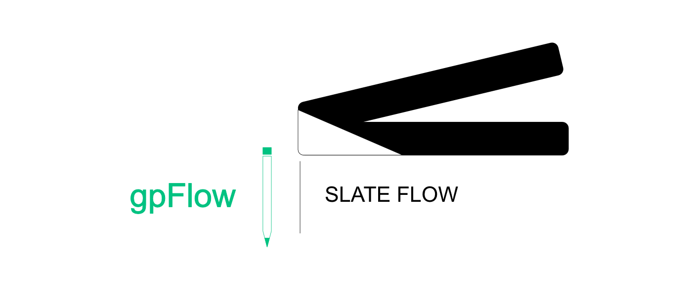
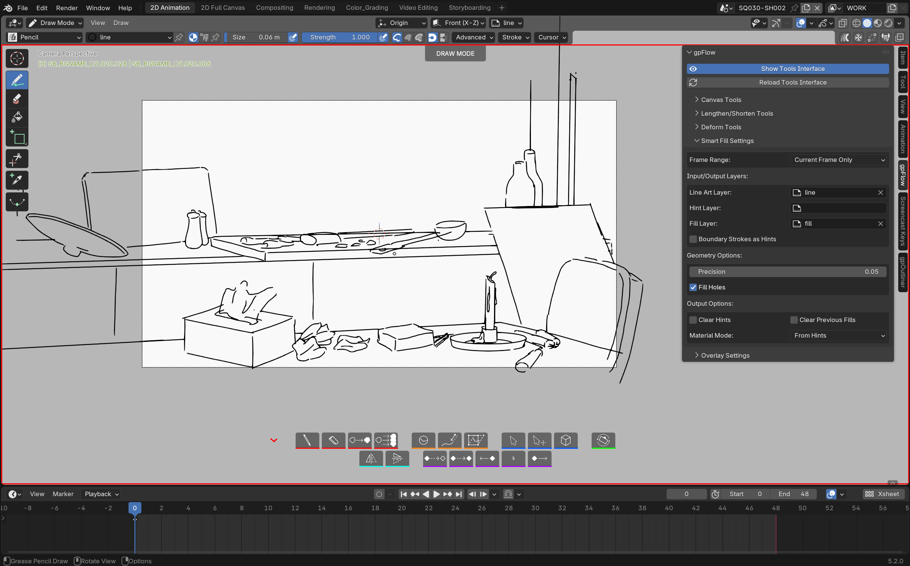

# gpFlow

{: .addon-hero-logo }

**A faster way to draw with Grease Pencil in Blender.**

gpFlow adds a floating, GPU-drawn toolbar right inside the 3D Viewport,
putting the Grease Pencil tools you reach for constantly — draw, erase,
select, sculpt, fill, flip — one click away instead of buried in menus and
mode switches. It doesn't reinvent Grease Pencil: it drives Blender's own
brushes, modes and operators, just with a lot less friction between you and
the next stroke.

## At a glance

- **Draw / Erase / Fill in one click each**, with the last brush used
  remembered per mode. Fill drives Blender's own native Fill tool (every
  brush setting still applies); Shift+click removes a fill under the
  cursor, a gesture with no native equivalent.
- **Reshape without redrawing**: Lengthen/Shorten a stroke by grabbing its
  nearest endpoint and dragging; Deform drops a view-aligned lattice around
  your selection for quick, natural-looking distortion; Sculpt drops you
  straight into Blender's native sculpt mode.
- **Select & Transform** in one action — lasso-select a stroke and gpFlow
  hands you straight into Move, no extra click.
- **Flip that understands animation** — mirrors strokes around a shared
  center so a flipped pose stays consistent across frames, respecting
  multi-frame editing and locked layers.
- **Canvas rotation** — turn your camera to a more comfortable drawing
  angle without losing your original framing, with 15° snapping and a
  one-click return.
- **Animation shortcuts** — empty keyframe, duplicate the previous one
  (per-layer or across every visible layer), shift a run of keyframes.
- **Fully remappable shortcuts**, per tool, with live conflict detection.

See the **[Features](features.md)** page for a full visual walkthrough.

## Why it feels native

gpFlow never replaces a Blender tool, panel, or shortcut — it only adds a
layer on top. The toolbar is drawn directly into the viewport (no custom
windows, no hijacked UI regions), and every action it triggers is a real
Blender operator or mode switch. Turn gpFlow off, and your file, your
brushes, and your habits are exactly as Blender left them.

Requires **Blender 5.2 or newer**. No extra dependencies — gpFlow ships
self-contained and never reaches out to the network.

## License

[GNU General Public License v3.0 or later](https://www.gnu.org/licenses/gpl-3.0.html)
— SPDX: `GPL-3.0-or-later`.

Some utility and version-compatibility code is adapted from
[nijiGPen](https://github.com/chsh2/nijiGPen) by chsh2, also GPLv3-licensed.

gpFlow is part of the **[SlateFlow](../index.md)** suite.

## Support

slateFlow is developed in my spare time, alongside my freelance work. Prices
are deliberately affordable: in return, I can't commit to fix deadlines or
on-demand development. Feedback and ideas are welcome — the most important
bugs will be fixed, and good ideas will make their way in. Thank you for
your understanding.
