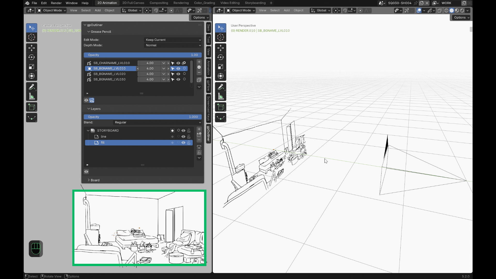

# Features

## Depth-sorted object list

Sort your Grease Pencil objects by distance to the camera, not just
alphabetically — there's no native way to do this in Blender; gpOutliner
computes it live along the camera's own facing direction. A per-row widget
lets you drag horizontally to adjust, use the `<`/`>` buttons for ±1, or
type an exact value.

## Compensate mode

Drag an object's depth and watch its scale adjust automatically to keep its
apparent size on screen constant, so you can restage a drawing in 3D space
without it visually growing or shrinking.

## Opacity & isolation

- **Global opacity per object** — one slider that fades every layer of a
  drawing together while preserving each layer's relative opacity, instead
  of having to touch each layer by hand.
- **One-click isolation** — hide every other Grease Pencil object, or every
  other layer on the current one. Turn it off and everything comes back
  exactly as it was.
- **Edit-mode memory** — choose whether switching between drawings keeps
  whatever mode you're in, or remembers and restores the last mode you used
  on each object individually.

## Camera tools

- **Optional camera list** in the same panel — visibility, selectability,
  active-camera switching, and quick local-Z positioning.
- **Camera background images** — add, reorder, and manage reference images
  or footage on your camera's background: load an image, toggle visibility,
  adjust opacity, and reorder the stack.
- **Camera constraints, one click** — Track To and Child Of, applied with
  automatic stroke compensation so your drawing doesn't visibly jump the
  moment the constraint kicks in (or drops out).

## 2D/3D view toggle

Swing your camera and selected drawings onto a flat reference axis for
comfortable, distortion-free flat drawing, then snap everything back to its
original 3D staging with a single click. Every other Grease Pencil object
in the scene stays visually put while you do it.

## Smart stroke operations

- **Duplicate Special** keeps you in your drawing mode across the
  duplicate.
- **Separate Special** lifts a selection straight into a new object.
- **Move to Special** sends selected strokes to any other object and layer
  you pick from a searchable list.

## Structure duplication

Copy an object's entire layer hierarchy without copying a single stroke,
ready for a fresh drawing on the same layer setup.
