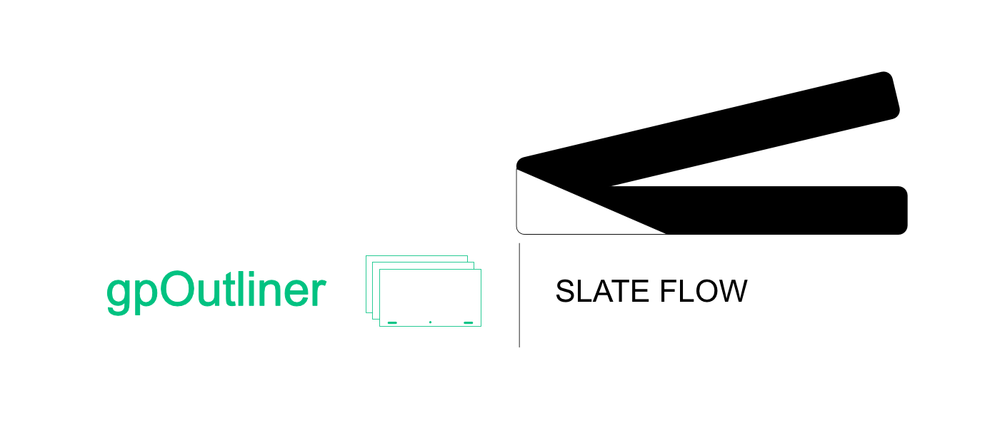

# gpOutliner

{: .addon-hero-logo }

**A dedicated command center for every Grease Pencil object in your scene.**

gpOutliner adds one focused panel to the 3D Viewport that brings Grease
Pencil object management, layer management, and camera setup together in a
single place — closer to the feel of a dedicated 2D drawing app, without
giving up anything the 3D viewport gives you. It never hides or replaces
Blender's native Outliner, Object Data Properties, or Grease Pencil
operators — it just puts the controls you reach for constantly right where
you're already drawing.

## At a glance

- **Depth-sorted object list** — sort your Grease Pencil objects by distance
  to the camera, not just alphabetically.
- **Compensate mode** — drag an object's depth and watch its scale adjust
  automatically to keep its apparent size on screen constant.
- **Edit-mode memory** — choose whether switching between drawings keeps
  whatever mode you're in, or remembers and restores the last mode you used
  on each object individually.
- **Global opacity per object** — one slider that fades every layer of a
  drawing together while preserving each layer's relative opacity.
- **Camera background images** — add, reorder, and manage reference images
  or footage on your camera's background, right from the same panel.
- **One-click isolation** — hide every other Grease Pencil object, or every
  other layer on the current one, with a single toggle.
- **Child Of camera constraint, one click** — a real Blender constraint,
  applied and named for you.
- **Boards** — group drawings under a dedicated camera, flip the whole
  group flat for comfortable 2D drawing, then snap back to the exact 3D
  staging you left, with no recentering or distortion.
- **Smart stroke operations** — Duplicate Special, Separate Special, and
  Move to Special.
- **Structure duplication** — copy an object's entire layer hierarchy
  without copying a single stroke.

See the **[Features](features.md)** page for a full visual walkthrough.

## Why it feels native

gpOutliner never invents a parallel system where Blender already has one:
layer management runs through Blender's own layer tree widget and
operators, the camera constraint is a real Blender constraint (just
applied and named for you), and nothing here locks you out of the native
Outliner or Properties editor. Only the handful of things Blender doesn't
offer directly — depth sorting, visual-scale compensation, board-based 2D
staging, multiplicative global opacity — get dedicated code.

Requires **Blender 5.2 or newer**.

## License

[GNU General Public License v3.0 or later](https://www.gnu.org/licenses/gpl-3.0.html)
— SPDX: `GPL-3.0-or-later`.

gpOutliner is part of the **[SlateFlow](../index.md)** suite.

## Support

slateFlow is developed in my spare time, alongside my freelance work. Prices
are deliberately affordable: in return, I can't commit to fix deadlines or
on-demand development. Feedback and ideas are welcome — the most important
bugs will be fixed, and good ideas will make their way in. Thank you for
your understanding.
