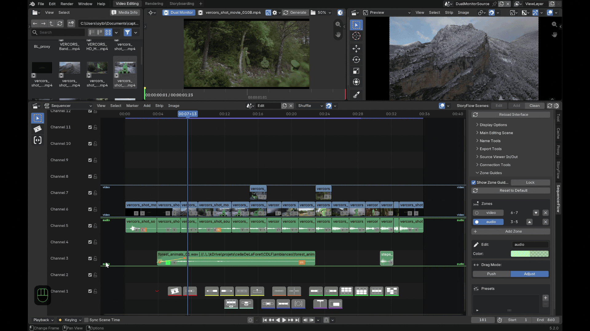

# Features

Each section below is tagged **LITE** and/or **PRO**. See
[LITE and PRO](index.md#lite-and-pro) for the full tier breakdown.

## Contextual toolbar — LITE and PRO

Drawn right into the VSE, no menu diving.

- **Cut** splits every selected strip at the playhead. On a SCENE strip (a
  storyFlow shot, say), a native split would leave both halves sharing the
  *same* underlying scene — Cut gives the right-hand half a full copy
  instead, so each half is independent from the start.
- **Join** only works on strips that are genuinely touching, on the same
  channel, same type and same source file — in practice, it undoes a
  Cut. It won't merge two different clips.
- **Swap** (left/right) swaps a strip, or a whole block of several
  touching selected strips on the same channel, with its single
  unselected neighbor on that side. The block moves as one rigid unit; a
  strip connected to another (see [Strip connections](#strip-connections-lite))
  is dragged along even if only its partner was selected.
- **Slip** invokes Blender's own native Slip tool.
- **Insert** (PRO) drops the Source Viewer's current in/out range at the
  playhead — see [Source Viewer](#source-viewer-pro).
- **Connect / Disconnect** — see [Strip connections](#strip-connections-lite).
- **Advanced selections**:

  | Action | Selects |
  |---|---|
  | Select channel | Every strip sharing a channel with the current selection |
  | Select above / below | Every strip in *any* channel beyond the selection's highest/lowest — not just the next one |
  | Navigate next/previous | The next or previous strip in time, moving the playhead to its start |
  | Selection sets | Save, recall or remove a named selection |

  Selection sets are matched back by name, type, position and channel —
  if a strip has since moved or been renamed, recall reports a partial
  restore instead of guessing.
- **Isolate** has two independent, reversible toggles, both based on
  muting (so they affect audio too): **Isolate Channel** mutes every
  channel but the selection's; **Isolate Selection** mutes every strip
  that isn't selected. Click again to restore.
- **Frame range** sets the *scene's* playback/render range, not just the
  view: **Range Selected**/**Range All** fit it once, **Auto Range** keeps
  re-fitting it to the selection continuously.
- **Follow playhead** scrolls the view to keep the playhead in a
  comfortable zone (25–40% of the visible width) during playback, instead
  of jumping or needing a manual re-center.
- **Minimap toggle** (PRO) — see [Timeline minimap](#timeline-minimap-pro).

## Strip connections — LITE

A connection is a shared, invisible link between related strips —
typically a video clip and its audio — so dragging, swapping or exporting
one takes its partner along. **Connect**/**Disconnect** on the toolbar
apply it to the current selection.

Connections aren't detected passively — the **Connection Tools** N-panel's
**Conditional Connect** drives that explicitly, by combining criteria and
applying them in one click:

| Condition | Groups strips that... |
|---|---|
| Same start / end frame | start, or end, at the same frame |
| Same channel / length | sit on the same channel, or share a duration |
| Movie-sound pairs | look like a matching video+audio pair, by name |

The common case is leaving only **Movie-sound pairs** checked. The same
panel also lists every existing connection group, with a button to select
the whole group at once.

Mainly there to prep a round-trip export:
**[sequencerOTIO](../sequencerOTIO/index.md)** (a separate SlateFlow
add-on) reads these links to keep video/audio pairs together when
exporting to Resolve via OpenTimelineIO.

## Zone guides — LITE and PRO

Colored separator lines across a range of channels (audio, video,
effects...), configurable in the **Zone Guides** N-panel.

- **Show Zone Guides** / **Lock** show or hide the overlay; Lock freezes
  the boundaries against dragging in the VSE without hiding them.
- The **zone list**: clicking a zone's name makes it active (editable
  below). Its channel range is shown read-only — there's no field to type
  it directly. To change it: drag a boundary in the VSE (click-drag the
  colored line, no modifier key, Esc cancels), or use ▲/▼, Add Zone,
  Reset or a preset.
- **▲ / ▼** don't reorder the list — they **swap a zone's position**
  with its neighbor, each keeping its own size, name and color.
- **+ Add Zone** adds a new zone right above the last one.
- The box below the list edits the active zone's **name** and **color**.
- **Drag Mode** decides what happens to the other zones when one is
  resized:

  | Mode | Effect |
  |---|---|
  | **Adjust** (default) | Only the one directly touching neighbor follows — everything else stays put. |
  | **Push** | The rest of the stack in that direction shifts along, like an accordion. |

- **Presets** save the current layout under a name, recall it, or delete
  it.

!!! info "Per scene"
    Zones and presets belong to the current scene, not the whole file —
    another scene (or the Source Viewer) has its own configuration.

## Batch rename & scene sync — LITE

The **Name Tools** N-panel renames a selection or the whole timeline
(**Find/Replace**, or **Set Name** with an optional prefix/suffix — the
suffix can auto-number instead, in **timeline order**, not selection
order). A live preview shows what the first affected strip would become.

Renaming a SCENE strip also renames its underlying scene to match,
automatically. **Sync Scene Names** re-applies that same strip→scene sync
on demand, without renaming anything first.

## Export segments — LITE

The **Export Tools** N-panel renders the timeline to one video file per
segment — not "each selected strip," and with no separate audio mixdown
(every unmuted sound strip in a segment's range mixes into that segment's
video automatically).

- **Export Range (In/Out)** is the same frame range as
  [Frame range](#contextual-toolbar-lite-and-pro) above, shown again here
  since it drives the export.
- A cut is placed only where the **topmost visible strip** actually
  changes — strips stacked underneath don't force their own cut. The
  panel shows a live count of the segments this would produce.
- **Naming**:

  | Mode | Segment name from... |
  |---|---|
  | **Topmost Strip** (default) | Whichever strip is topmost in that segment |
  | **Custom Pattern** | A base name + prefix/suffix/numbering — same engine as Batch Rename |

  A frame-number suffix is added on top either way, as the real
  collision guard (a strip can be topmost again later): off, a
  `0001-NNNN` duration count, or the actual **Timeline** frame numbers.
- Rendering uses the scene's own **Output Properties** (format, codec,
  path) — there's no separate format picker here. The panel warns if the
  output path is still Blender's default, usually a sign those properties
  were set on a different scene tab.

## Speed control — PRO

A small **s** badge next to the opacity icon on every retimable strip
(not effect strips — SOUND included, so a connected video+audio pair can
be retimed together), colored grey/blue/purple for normal/set/frozen.
Click it for the **Set Speed** dialog: a **percentage** (100 = normal, 50
= half speed, 200 = double), or **Freeze Frame** to hold the in-point
instead.

Both drive Blender's own native retiming operators — never a parallel
speed model. The factor is also written to the strip
(`strip["otio_speed"]`) so **[sequencerOTIO](../sequencerOTIO/index.md)**
can carry it over on export.

## Source Viewer — PRO

Real 3-point editing in Blender, through two interchangeable ways of
previewing a source:

- **Dedicated scene**: the classic Source Viewer — set IN/OUT points on any
  clip in its own scene, with your edit scene untouched while you browse
  footage.
- **Dual Monitor**: an independent second preview (built on the Movie Clip
  Editor) with its own playhead, image and audio — genuinely simultaneous
  with the main edit, not a toggle between the two.

Either way, **Insert** drops the selected in/out range at the playhead,
rippling every later strip out of the way automatically. A shared media
history and IN/OUT points work across both modes. Before loading anything,
the **Folder Media Info** overlay shows a comparison table (fps,
resolution, duration, color profile) directly in the File Browser, so you
can compare candidate files without opening each one first.

## Strip curves — PRO

Volume and opacity curves drawn directly on strips — no need to open the
Graph Editor:

- **Ctrl+click** anywhere on a strip adds a keyframe there.
- **Click and drag** an existing key to move it.
- **Double-click** a key opens its exact Frame/Value for direct editing.

These drive real Blender F-Curves on the strip's own `volume` or
`blend_alpha` — opening the Graph Editor on the same strip shows the same
keys.

## Advanced audio — PRO

- A real-time **VU meter** (dB level plus peak since last reset),
  dockable left or right.
- Every sound strip gets a **channel badge** showing its real format at a
  glance (Mono / Stereo / 5.1 / 7.1).
- Click a badge to force that strip to **mono**, with its own **Left /
  Center / Right** pan.

## Timeline minimap — PRO

A 2D (time × channels) overview of the whole timeline in a fixed-size
corner panel — one silhouette per strip, colored from its own color tag or
its type's native color, plus an outline of the current viewport. Click or
drag to recenter the main view there.
