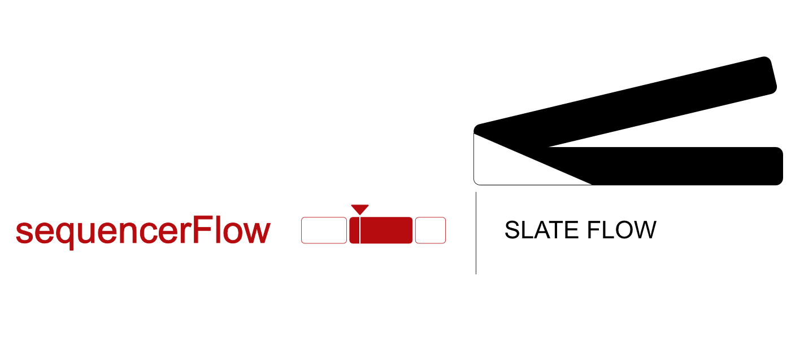
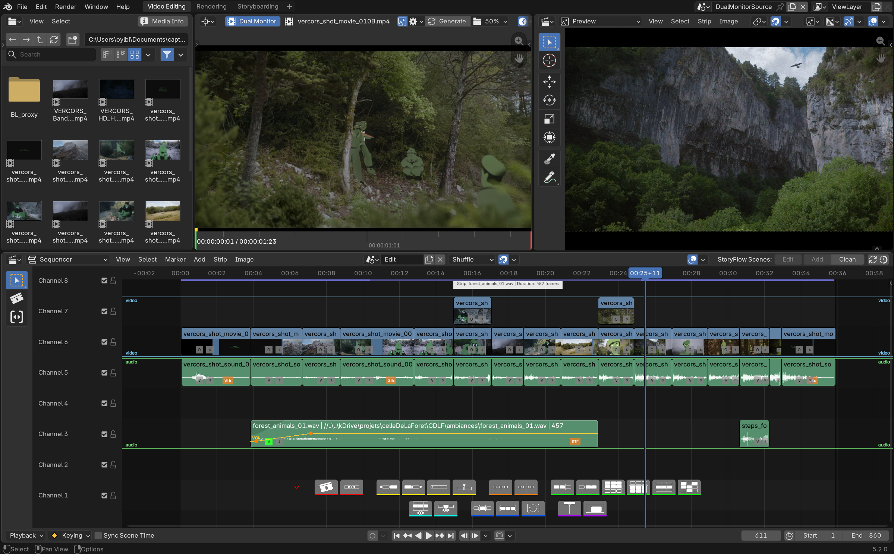

# sequencerFlow

{: .addon-hero-logo }

**Premiere/Resolve-style editing tools for Blender's Video Sequence Editor.**

sequencerFlow adds a floating, GPU-drawn toolbar and a set of production
tools directly into the VSE, closing the gap between Blender's native
sequencer and a dedicated NLE.

## LITE and PRO

sequencerFlow ships as two tiers from the same codebase:

- **LITE** (free): the contextual toolbar (except Insert), strip
  connections, advanced selections, channel/strip isolation, frame range,
  batch rename, per-strip export, zone guides, configurable shortcuts.
- **PRO** (paid): everything in LITE, plus the **Source Viewer** (3-point
  editing and Insert), volume/opacity **curves drawn on strips**, **speed
  control** (retiming badge and freeze frame), advanced **audio** tools (VU
  meter, channel reassignment), and the timeline **minimap**.

See **[Features](features.md)** for the detailed breakdown.

## At a glance

- **A contextual toolbar drawn right into the VSE**: smart split, join,
  swap, slip, directional/channel selection, selection sets, channel and
  selection isolation, auto-fit frame range, follow-playhead during
  playback.
- **Source Viewer** (PRO) — real 3-point editing: set IN/OUT points on any
  source clip in a dedicated space (second monitor or scene), then insert
  at the playhead with every later strip rippling out of the way
  automatically.
- **Zone guides** — colored bands across channel ranges so a busy timeline
  stays organized and readable at a glance.
- **Volume and opacity curves** (PRO) drawn directly on strips,
  click-and-drag editable — driving real Blender F-Curves.
- **Speed control** (PRO): a badge on every strip for quick retiming,
  percentage-based speed dialog, freeze frame, all built on Blender's own
  native retiming operators.
- **Strip connections** — automatic or manual linking between related
  strips (typically a video clip and its audio). Reads these links to keep
  video/audio pairs together when exporting to Resolve via
  **[sequencerOTIO](../sequencerOTIO/index.md)** (a separate SlateFlow
  add-on).
- **Batch rename** and **per-strip export**.

## Why it feels native

sequencerFlow never replaces a Blender panel, tool or shortcut — it only
adds a layer on top. The toolbar and every overlay (curves, zone guides,
connection markers) are drawn straight into the viewport, and every action
they trigger is a real Blender operator or a real F-Curve edit. Disable it,
and your strips, keyframes and scenes are exactly as Blender left them.

Requires **Blender 5.2 or newer**.

## License

[GNU General Public License v3.0 or later](https://www.gnu.org/licenses/gpl-3.0.html)
— SPDX: `GPL-3.0-or-later`.

sequencerFlow is part of the **[SlateFlow](../index.md)** suite.

## Support

slateFlow is developed in my spare time, alongside my freelance work. Prices
are deliberately affordable: in return, I can't commit to fix deadlines or
on-demand development. Feedback and ideas are welcome — the most important
bugs will be fixed, and good ideas will make their way in. Thank you for
your understanding.

Found a bug? See [Reporting a bug](../index.md#reporting-a-bug) for what
to include.
