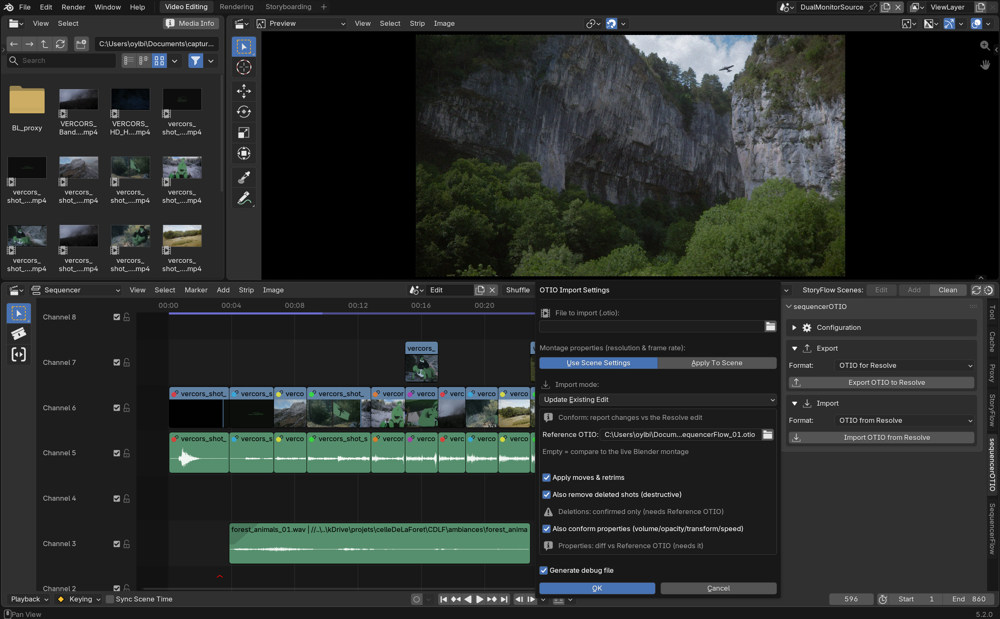

# Features

The **sequencerOTIO** panel lives in the Sequencer sidebar (N-panel), in
three collapsible sections: Configuration, Export, Import. See
[Configuration](configuration.md) for the first one.

## Export

Turns the current VSE edit into a `.otio` file tuned for Resolve.

**Options:**

- **Export Folder / Filename** — where the `.otio` file is written. An
  **Update Paths** action fills both in automatically from the current
  `.blend` file's own location and name.
- **Scope**: **All strips**, or **Selected only** — export the whole
  timeline, or just the strips you've selected, without having to
  temporarily hide or isolate anything.
- **Native Resolve Fades** (on by default) — converts a pure fade at a
  clip's edge (opacity/volume ramping to zero) into Resolve's own native
  video transition or audio fade, instead of leaving it as raw opacity/
  volume keyframes. An editor picking up the timeline in Resolve gets real
  fade handles to grab, not keyframes to decode.
- **Debug Export** — writes a companion debug report next to the `.otio`
  file and loads it straight into Blender's text editor, so you can see
  exactly what was written without digging through a hidden log.

**What always gets carried over, regardless of these options:**

- One OTIO track per Blender channel actually in use — including empty
  channels, so the track layout survives the round-trip. Blender's lowest
  video channel becomes `Video 1`; audio channel order is flipped to match
  how Resolve stacks its audio tracks.
- Volume/opacity keyframes as Bézier curves, never flattened.
- Speed changes and freeze frames, encoded as OTIO `TimeEffect`s.

!!! info "Paths and media relinking"
    If a media source referenced by the edit lives outside the export
    folder, Resolve may not relink it automatically — the export warns you
    (debug report + popup) when this happens, so you know to relink
    manually or re-export alongside the media.

## Import

Bringing a `.otio` back from Resolve, in one of four modes:

| Mode | What it does |
|---|---|
| **Add To Current Scene** | Imports alongside whatever's already there. |
| **New Scene** | Creates a dedicated scene for the import, leaving the current one untouched. |
| **Replace Current Edit** | Clears the scene's VSE first, then imports — a full re-sync. |
| **Update Existing Edit** (Conform) | Compares the current montage to the Resolve edit and reports — or applies — just the differences. See below. |

**Montage properties** (resolution and frame rate, read from the OTIO file
by default) can instead be set manually and applied to the scene — useful
when the `.otio` doesn't carry reliable project settings. A **Resolution**
dropdown offers common presets (HD, UHD 4K, DCI 2K/4K, SD PAL/NTSC, square,
vertical, anamorphic scope) alongside a custom width/height.

### Conform (the round-trip mode)

Compares the **live Blender edit** against the Resolve export and
classifies every clip:

| Status | Meaning |
|---|---|
| Unchanged | No difference detected |
| Moved | Position changed |
| Retrimmed | In/out points changed |
| Split | Clip was cut into more than one piece |
| Changed | Properties (opacity, volume, transform, speed) differ |
| New | Present in the Resolve export, not in Blender |
| Deleted | Present in Blender, missing from the Resolve export |

**Conform options:**

- **Reference OTIO** (optional) — the original Blender export, the
  "before" state. Without it, conform compares against the live Blender
  edit directly; providing it sharpens the diff (in particular, it's
  required to confirm real *deletions*, see below).
- **Apply moves & retrims** — off by default, meaning conform first runs
  as a dry-run report with nothing applied. Turn it on to actually move
  and retrim the matching strips.
- **Also remove deleted shots** (destructive) — removes strips confirmed
  as deleted by comparing against the **Reference OTIO**. Never removes
  anything without that reference to confirm the deletion is real, not
  just a clip conform couldn't match.
- **Also conform properties** — reapplies volume, opacity, transform and
  speed (and fades, via opacity/volume) wherever they differ between the
  reference export and the Resolve return. Also requires the reference.
- **Generate debug report** (on by default) — same debug file as export,
  written next to the imported OTIO and loaded as a text block.

You can then **apply just the changes you want** — nothing gets blindly
re-imported, so edits made inside Blender *after* the original export
aren't discarded just because Resolve sent something back.

!!! info "What's in scope for conform"
    Conform works on any strip backed by real media (video/image/sound
    clips). Color strips, text strips, drawing scenes and adjustment layers
    sit outside the diff and are left untouched.
