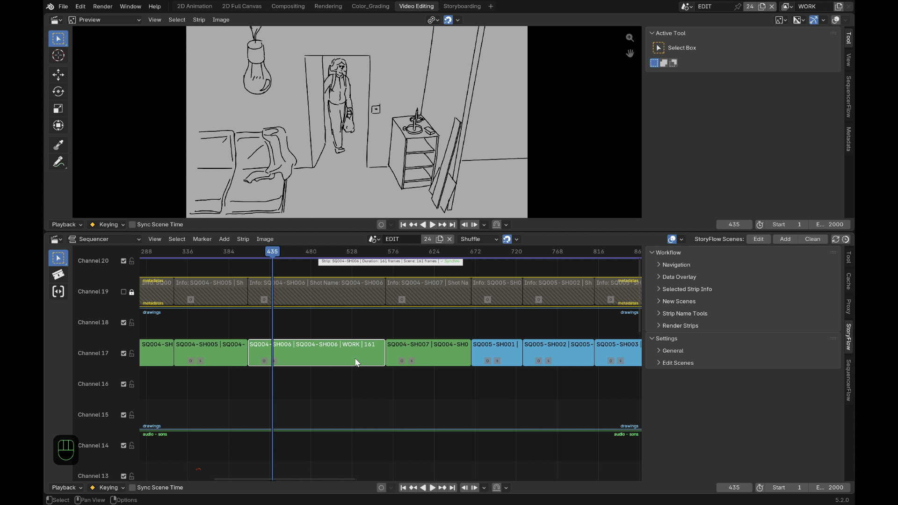
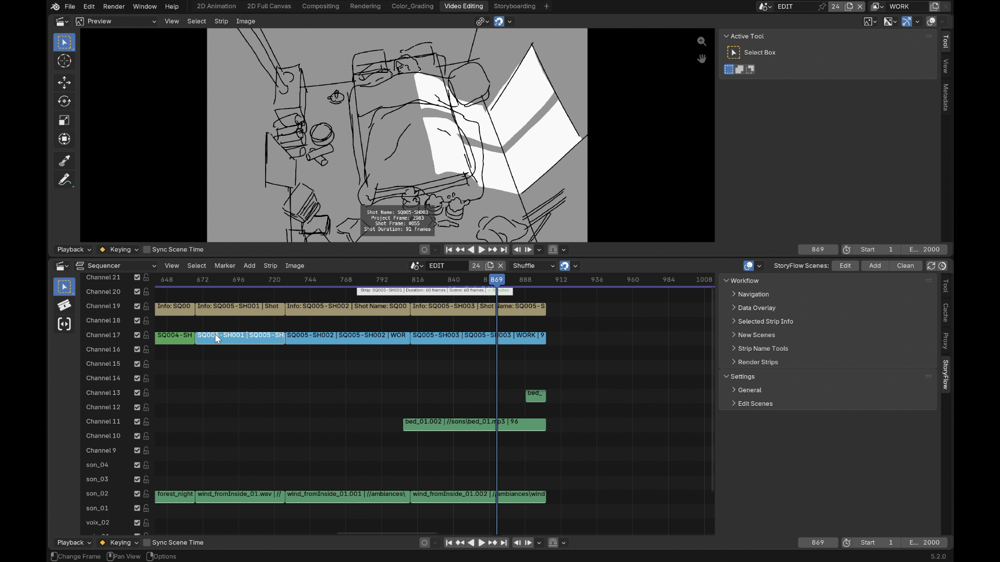
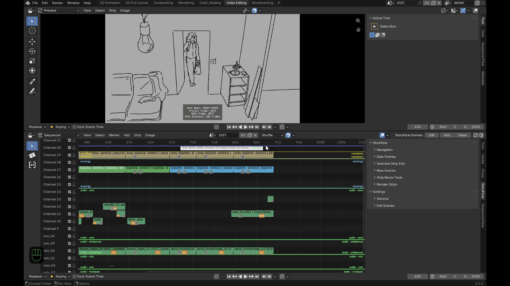

# Features

## Navigation

- **Tab** switches between the selected shot and its drawing scene,
  landing at the matching *frame* in both directions — not just switching
  scenes. Tab also swaps between the "Video Editing" and "2D Animation"
  workspaces, and points the drawing workspace's own embedded Sequencer at
  the main edit scene (handy if your animation-scene template keeps the
  VSE visible there too).
- **Ctrl+Alt+←/→** moves between the current shot's animation keys first;
  once you've reached the last (or first) key, the next press moves on to
  the next (or previous) shot instead.
- **Alt+←/→** moves between drawing scenes directly, without leaving the
  drawing context.

## Duration sync, both ways

Resize a drawing scene's frame range and its strip in the edit follows;
resize the strip and the drawing scene follows.

Three explicit ways to extend or shrink a shot in the edit:

- **Default** (drag a handle, or double-click without the option
  checked): trims the neighboring shot wherever it would overlap.
- **Ctrl held** while dragging a handle: pushes every following (or
  preceding) shot, across every channel, instead of trimming.
- **Double-click a handle** opens a popup to add or remove an exact
  number of frames, with the same choice to push/pull the following or
  preceding shots if needed.

## Shared-scene protection

If two shots ever end up pointing at the same drawing scene — a copy/paste
across files, a manual scene reassignment — a **red marker** appears
directly on both strips so it doesn't go unnoticed. While a drawing scene
is shared this way, editing the in/out points of the shots involved (or
the drawing scene's own duration) is locked to prevent silently
corrupting one of them; the lock lifts itself automatically once the
sharing is resolved.

## A live overlay on the selected shot

A small on-screen overlay shows the selected shot's name and duration at a
glance in the VSE, without opening a side panel.

## Sound follows the picture

Audio overlapping a shot gets copied into its drawing scene automatically,
correctly repositioned, with pitch, pan, volume and speed preserved — so
you can hear timing while you draw, with no manual copying. Muted audio
tracks can be excluded from this copy.

## Metadata burned onto the image

storyFlow can burn metadata directly onto the frame, each one an
**independent toggle** rather than an all-or-nothing overlay:

- Shot name.
- Project-relative frame number.
- Shot-relative frame number (starting at 0 or at 1, your choice).
- Duration.
- Start/end frame markers.

## Production tools

Beyond the day-to-day flow, storyFlow also covers the housekeeping that
comes with a real production:

- **Add**, one shot or several at once, with naming, prefix/suffix and
  auto-numbering. Lands next to your selected shot — or, with nothing
  selected, at the playhead or at the end of the timeline, your choice.
  Every shot it creates is its own independent scene.

- **Batch rename**, on the selection or the whole timeline at once: either
  find/replace across existing names, or set a new base name with
  prefix/suffix and auto-numbering — numbered in timeline order, not
  selection order, so the sequence always reads correctly.
- **Clean up unused drawing scenes** in one click, with per-scene
  protection for anything you want kept regardless.
- **Render straight from the timeline**, as an image sequence or video —
  split into segments wherever the topmost visible strip actually
  changes, so shots deliberately layered across channels render correctly
  instead of one silently winning for its whole original duration.
  Image-sequence rendering follows the drawing's *actual* keyframes
  (objects, Grease Pencil, NLA, scene markers), not a fixed interval.
  Segments are named either after the topmost strip, or with your own
  prefix/suffix/numbering scheme (same options as batch rename), plus a
  frame-range suffix as an anti-collision safeguard. The result can be
  dropped back into the timeline as new strips automatically.
