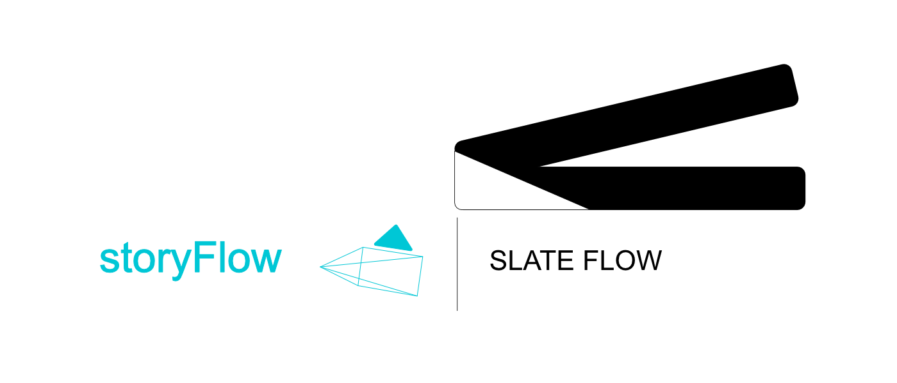
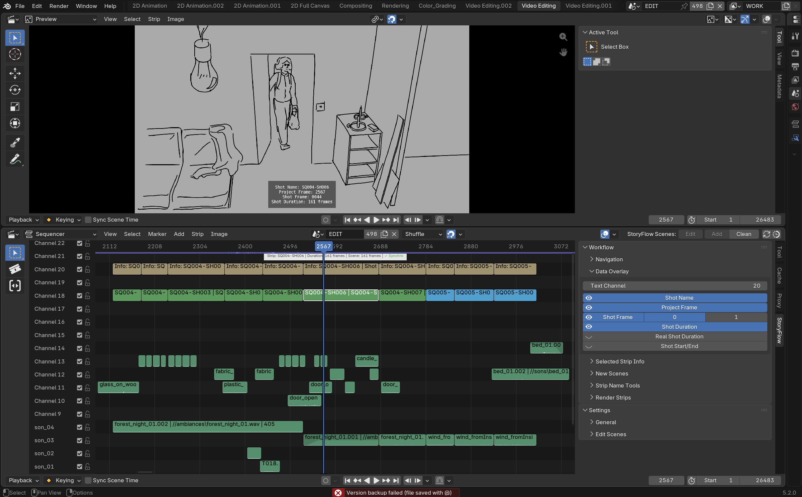
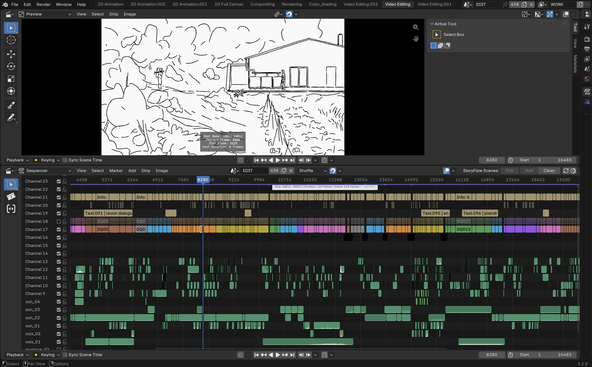

# storyFlow

{: .addon-hero-logo }

**Storyboarding and animatic work in Blender's VSE, without fighting the tool.**

storyFlow extends the official **Storypencil** add-on (Blender Foundation) to
turn the Video Sequence Editor into a real storyboard/animatic bench: an
edit scene where every shot is a SCENE strip pointing to its own Grease
Pencil drawing scene. It doesn't introduce a parallel editing or drawing
engine — it works entirely through Blender's native scenes, workspaces and
strips, and quietly fills in the seams Blender leaves exposed for this
specific workflow: switching between a shot and its drawing loses your
place, durations drift out of sync, two shots can end up pointing at the
same drawing without warning, nothing tells you at a glance whether a shot
is in sync with its drawing. storyFlow closes those gaps so the back-and-forth
between editing and drawing stays fast and stays out of your way.

## At a glance

- **One click to start a project**: "Setup Storyboard Session" creates the
  edit scene and a template drawing scene, loads the right workspace, and
  adds your first shot — ready to draw.
- **Tab between a shot and its drawing**, landing in the right *frame*, not
  just the right scene, in both directions.
- **Durations stay in sync both ways**: resize a drawing's frame range and
  its shot strip follows; resize the strip and the drawing scene follows.
- **A warning before it becomes a problem**: a red marker appears if two
  shots ever end up pointing at the same drawing scene.
- **Sound follows the picture**: overlapping audio is copied into each
  drawing scene automatically, pitch/pan/volume/speed preserved.
- **Metadata burned onto the image** when you need it — shot name, frame
  number, duration — each an independent toggle.
- **Production tools**: batch add/rename shots, clean up unused drawing
  scenes, render straight from the timeline.

See **[Features](features.md)** for a visual walkthrough of all of the above.

## Why it feels native

storyFlow never replaces a Blender scene, workspace, panel or shortcut —
every feature builds directly on top of them. Turn the add-on off and
you're left with an ordinary `.blend` file: real scenes, real strips, real
constraints, nothing that requires storyFlow to make sense of. The "Video
Editing" and "2D Animation" workspaces it relies on are Blender's own
standard workspaces, not custom UI.

## Requirements

**Blender 5.0 or newer** (5.2 LTS recommended). storyFlow relies on the
sequencer strip API (`Strip`, `SceneStrip`, `Window.workspace.sequencer_scene`)
introduced in Blender 5.0.

## License

[GNU General Public License v3.0 or later](https://www.gnu.org/licenses/gpl-3.0.html)
— SPDX: `GPL-3.0-or-later`.

Based on the [Storypencil](https://developer.blender.org/docs/features/scene_and_object/storypencil/)
add-on (Blender Foundation, GPL) by Antonio Vazquez, Matias Mendiola, Daniel
Martinez Lara, Rodrigo Blaas and Samuel Bernou.

storyFlow is part of the **[SlateFlow](../index.md)** suite.
