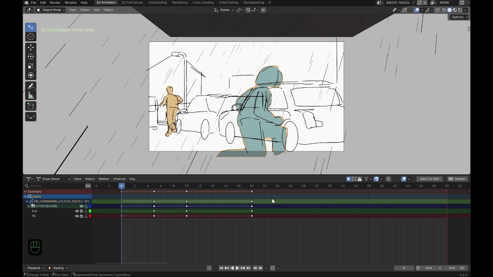
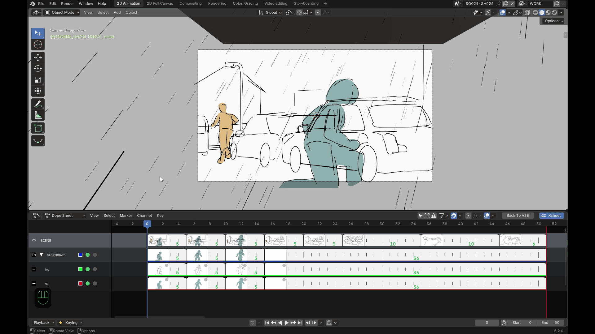
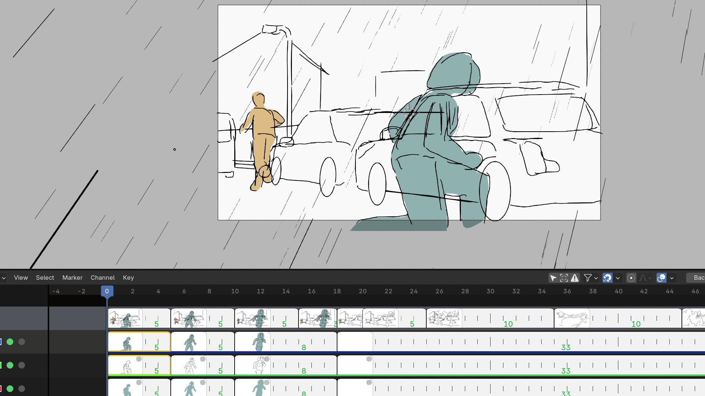

# Fonctionnalités

*(aperçu général — voir le détail de chaque fonctionnalité ci-dessous)*

## Vignettes réelles

Chaque clé est affichée comme une vraie miniature du dessin, générée par
rasterisation GPU directe des traits Grease Pencil — pas un rendu complet de
la scène. Les couleurs de matériau, de vertex paint et de fill sont prises
en compte, avec le même rendu que dans le viewport.

Les vignettes sont mises en cache : une clé n'est régénérée que si son
contenu a réellement changé. Sur un dessin très dense, la génération se
fait par petits lots en arrière-plan pour ne jamais bloquer l'interface —
vous verrez brièvement un placeholder avant que la vignette définitive
apparaisse.

## Hiérarchie Scene / Summary / Groupes / Layers

Quatre niveaux de rangées, chacun avec sa propre vignette composite :

- **Scene** : composite de tous les objets Grease Pencil visibles de la scène.
- **Summary** : composite de tous les layers visibles d'un objet.
- **Groupe** : composite des layers visibles de ce groupe.
- **Layer** : le dessin réel, clé par clé.

Chaque niveau peut être affiché ou masqué indépendamment depuis le
N-panel (voir [Préférences](preferences.md)).

## Déplacer une clé (trim / ripple)

Cliquez-glissez une vignette pour déplacer sa clé dans le temps :

| Mode | Effet |
|---|---|
| **Trim** (sans modificateur) | Seules les clés sélectionnées se déplacent (ensemble, espacement relatif conservé), avec une butée qui empêche de dépasser la clé non sélectionnée la plus proche, des deux côtés. |
| **Ripple** (Ctrl maintenu) | Les clés sélectionnées **et toutes celles qui suivent** se décalent ensemble du même delta — seule la clé précédente (qui ne bouge jamais) borne le mouvement. |

### Multi-sélection et groupes

- **Shift+clic** sur une vignette ajoute ou retire une clé de la sélection,
  y compris à travers plusieurs layers ou plusieurs groupes.
- Déplacer la vignette d'un **groupe** déplace réellement la clé
  correspondante sur **chacun de ses layers enfants** — le groupe se
  comporte comme un parent.

## Aperçu flottant (Alt + survol)

Maintenez **Alt** en survolant n'importe quelle vignette pour afficher un
aperçu flottant agrandi près du curseur — pratique pour juger un dessin
sans quitter la vue d'ensemble de l'xsheet. Sa taille est réglable
(**Hover Preview Scale** dans le N-panel propre à l'addon, voir
[Préférences](preferences.md)).

## Isoler une rangée

Un bouton **Isolate** sur chaque rangée masque toutes les autres (un vrai
*hide* Blender, pas un simple filtre d'affichage). **Shift+clic** cumule
l'isolation sur plusieurs rangées à la fois. Isoler un layer enfant rend
automatiquement visible la chaîne de ses groupes parents.

## Couleur de canal et type de clé

- Un **swatch de couleur** dans la colonne de channels permet de changer la
  couleur du layer ou du groupe directement depuis l'overlay (même color
  wheel natif que Blender).
- Une **pastille de type de clé**, dans le coin de chaque vignette, permet
  un **clic droit** pour choisir le type de keyframe (mêmes types et icônes
  que le `keyframe_type` natif de Blender).

## Renommer un layer ou un groupe

**Double-cliquez** sur le nom d'un layer ou d'un groupe (en dehors des
icônes) pour ouvrir une popup de renommage. Les collisions de nom sont
gérées automatiquement par Blender, comme pour n'importe quel layer natif.

## Scrubbing dans la vue 3D

Dans la vue 3D, maintenez **Alt+M** (raccourci personnalisable, voir
[Préférences](preferences.md)) pour afficher un défileur de vignettes près
du curseur, sans jamais quitter la vue 3D :

- **Glissez horizontalement** pour parcourir les clés du layer actif dans
  le temps.
- **Déplacez la souris verticalement** pour changer de layer scrubbé — un
  changement réel et persistant une fois la touche relâchée, pas un simple
  aperçu temporaire. Les layers cachés (ou dont un groupe parent est caché)
  ne sont jamais atteignables de cette façon.
- Le curseur **boucle sur les bords de l'écran** pendant le scrub, comme
  dans les outils natifs de Blender — vous pouvez continuer à scruber sans
  jamais être bloqué par le bord de la fenêtre.

!!! info "Pas de onion skin dans les vignettes"
    Afficher les dessins voisins (avant/après) en fondu dans la vignette
    elle-même a été testé puis abandonné : l'encre rasterisée étant noire,
    un simple réglage d'opacité rend le fantôme illisible plutôt
    qu'utile. Une vraie recoloration demanderait un shader dédié, non
    disponible aujourd'hui.
