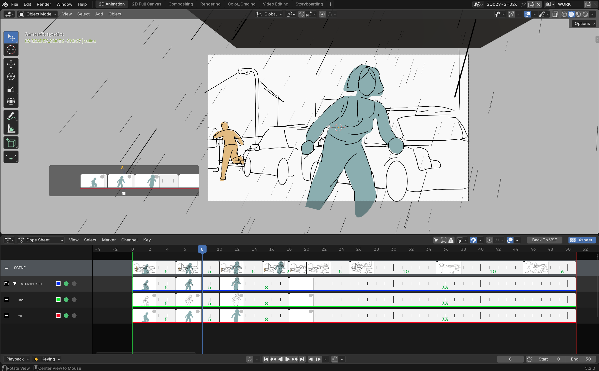

# dopesheetFlow

{: .addon-hero-logo }

**Une vraie table lumineuse pour le Grease Pencil, dans la Dope Sheet de Blender.**

dopesheetFlow transforme la Dope Sheet en "xsheet" : chaque clé Grease Pencil
est affichée comme une vraie vignette du dessin, par layer, alignée sur les
frames, avec une réglette de tenue entre deux instances — le workflow de
table lumineuse de Toon Boom, TVPaint ou OpenToonz, sans jamais quitter la
Dope Sheet native de Blender.

Pas de nouvel éditeur : une bande dessinée par-dessus la colonne de channels
existante, avec sa propre hiérarchie Scene / Summary / groupes / layers,
activable depuis un bouton dans l'en-tête de la Dope Sheet.

## En un coup d'œil

- **Vraies vignettes**, générées par rasterisation GPU directe des traits
  Grease Pencil (pas un rendu complet), avec cache et génération asynchrone
  pour rester fluide même sur des dessins denses.
- **Hiérarchie complète** : une rangée Scene (composite de tous les objets GP
  visibles), une rangée Summary (composite des layers d'un objet), des
  groupes et des layers — chaque niveau avec sa propre vignette composite,
  chacun activable/désactivable indépendamment.
- **Déplacer une clé** à la souris, avec deux modes (trim / ripple),
  multi-sélection inter-layers et inter-groupes, et déplacement
  "groupe-comme-parent" (déplacer la vignette d'un groupe déplace la vraie
  clé de chacun de ses layers enfants).
- **Alt + survol** pour un aperçu flottant agrandi de n'importe quelle vignette.
- **Isoler** une rangée en un clic (vrai *hide* Blender, cumulable avec
  Shift+clic sur plusieurs rangées).
- **Couleur de canal et type de clé**, modifiables directement depuis
  l'overlay.
- **Renommer** un layer ou un groupe en double-cliquant sur son nom.
- **Scrubbing dans la vue 3D** : une touche maintenue affiche un défileur de
  vignettes près du curseur, sans jamais quitter la vue 3D.

Voir la page **[Fonctionnalités](features.md)** pour une démonstration
complète en images.

## Pourquoi ça reste "natif"

dopesheetFlow n'introduit pas de nouvel éditeur ni de modèle de données
parallèle — Blender ne permet pas de créer un espace/éditeur custom en
Python, et cet addon n'en a pas besoin. Tout ce qu'il affiche et déplace
est un vrai layer, groupe ou keyframe Grease Pencil. Désactivez l'overlay
depuis le bouton d'en-tête : la Dope Sheet redevient exactement celle de
Blender, channels compris.

Nécessite **Blender 5.2 ou plus récent** (Grease Pencil v3).

## Licence

[GNU General Public License v3.0 ou ultérieure](https://www.gnu.org/licenses/gpl-3.0.html)
— SPDX : `GPL-3.0-or-later`.

dopesheetFlow fait partie de la suite **[SlateFlow](../index.md)**.

## Support

Ce projet est développé à son propre rythme, sur le temps libre de son
auteur. Il est fourni **en l'état**, sans garantie.

Un bug à signaler, une suggestion ? Utilisez le canal de support indiqué
sur votre page d'achat — chaque message est lu, mais sans garantie de délai
de réponse.
