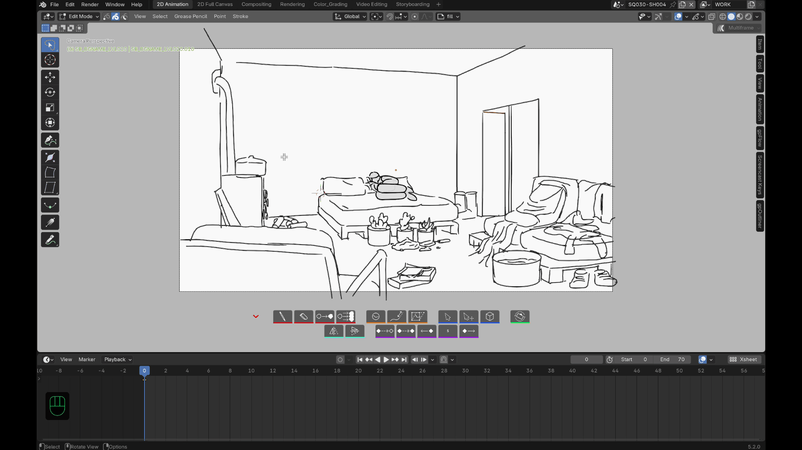
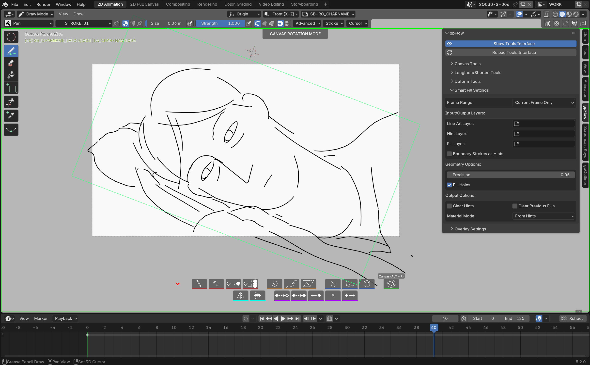

# Fonctionnalités

Chaque bouton de la toolbar a son propre raccourci clavier, affiché dans
son tooltip et reconfigurable dans **[Préférences](preferences.md)** —
plus rappelé pour chaque outil ci-dessous.

## Dessin

- **Mode Dessin** en un clic, avec la dernière brosse utilisée pour ce
  mode — mémorisée pour la session en cours, pas conservée au redémarrage
  de Blender.
- **Mode Gomme** en un clic, cohérent avec les autres modes.
- **Mode Fill** en un clic — pilote l'outil Fill natif de Blender, tous
  les réglages de brosse (lignes d'extension, fermeture d'écart...)
  s'appliquent toujours. **Shift+clic** supprime un remplissage sous le
  curseur, cherché sur tous les calques visibles et déverrouillés (pas
  seulement le calque actif, puisqu'un remplissage atterrit sur le calque
  actif au moment du clic, qui peut avoir changé depuis) — un geste sans
  équivalent natif.

Dans ces trois modes, le clic droit continue d'ouvrir les options natives
de la brosse ou de l'outil Fill (direction, réglages...) plutôt que de
fermer le mode — seuls **Échap** et **Entrée** en sortent. Ctrl+Z /
Ctrl+Shift+Z annulent/rétablissent sans vous faire perdre la brosse en
cours.

## Retravailler les traits

- **Lengthen/Shorten** — saisissez l'extrémité la plus proche d'un trait,
  surlignée en survol, et glissez.

L'outil reste actif après chaque glisser : vous pouvez enchaîner plusieurs
traits à la suite sans le relancer (Échap ou clic droit pour sortir pour de
bon). Le panneau **Lengthen/Shorten Tools** de la sidebar règle l'affichage
des extrémités (visibilité, taille) et le rayon de détection sous le
curseur.

- **Deform** pose un treillis aligné sur la vue au moment de la création,
  autour de votre sélection pour une distorsion rapide et naturelle (2D ou
  volumétrique, résolution réglable). **Ctrl+clic sur le bouton Deform**
  (ou son raccourci dédié, indépendant du raccourci Deform de base et
  réglable dans les Préférences) pour construire ce treillis directement à
  partir d'une sélection déjà faite, sans avoir à resélectionner une fois
  dans l'outil.

Le panneau **Deform Tools** règle l'axe d'alignement du treillis, le mode
2D/3D et le nombre de subdivisions avant de lancer l'outil. Un seul treillis
à la fois : une fois la distorsion commencée, l'outil n'en recrée pas un
second pour une nouvelle sélection dans la même utilisation — ressortez et
relancez Deform pour enchaîner sur un autre groupe de traits.

- **Sculpt** bascule directement en mode sculpt natif de Blender, avec un
  comportement d'undo plus sûr. Comme pour Dessin/Gomme/Fill, le clic droit
  garde son usage natif ; seuls Échap/Entrée ramènent en mode Dessin.

## Select & Transform

- **Select** arme directement l'outil lasso natif en mode Édition, prêt à
  sélectionner — sans passer par aucun menu. **X** supprime la sélection
  courante sans sortir de l'outil ; Ctrl+Z/Ctrl+Shift+Z fonctionnent
  normalement.
- **Select & Transform** fait la même chose, puis bascule automatiquement en
  Déplacer dès que le lasso fait passer la sélection de zéro à au moins un
  point — pas de clic supplémentaire entre sélectionner et déplacer.

## Flip

Reflète les traits autour d'un centre partagé pour qu'une pose retournée
reste cohérente d'une image à l'autre. S'applique à la sélection de traits
en cours, ou à tous les traits des calques visibles/déverrouillés si rien
n'est sélectionné (jamais un no-op silencieux). Respecte le multi-frame
editing — avec l'édition multi-images active, toutes les images-clés
sélectionnées sont retournées ensemble autour du même axe, pas image par
image — et ignore automatiquement les calques verrouillés.

## Canevas

Cliquez le bouton **Canvas**, puis glissez horizontalement pour tourner la
**caméra de la scène elle-même** (pas seulement la vue) autour de son axe
local, vers un angle de dessin plus confortable sans perdre le cadrage
d'origine : **Ctrl** maintenu pendant le glisser pour un magnétisme par
incréments de 15°. Un cadre de référence vert reste affiché en permanence
pendant la rotation pour toujours savoir de combien vous avez tourné par
rapport au point de départ.

Deux façons équivalentes de revenir directement au cadrage d'origine, sans
attendre un nouveau glisser : **Ctrl+clic sur le bouton Canvas lui-même**
(avant de commencer un glisser), ou maintenir **Ctrl** et cliquer pendant
qu'un glisser est déjà en cours — les deux annulent/réinitialisent
immédiatement. Le bouton **Reset Canvas Rotation** du panneau **Canvas
Tools** dans la sidebar fait la même chose. Le cadrage d'origine n'est
mémorisé **qu'une seule fois** par scène, à la première utilisation de
l'outil. Le même panneau relaie aussi l'opacité du passe-partout caméra,
réglage natif de Blender.

## Raccourcis d'animation

- Insérer une clé vide à la frame courante, sur tous les calques visibles —
  ou **Ctrl+clic sur le bouton** pour la restreindre au seul calque actif.
- Dupliquer la clé précédente, même logique clic / Ctrl+clic (tous les
  calques visibles, ou seulement l'actif).
- Décaler toute une séquence de clés en avant ou en arrière, d'un nombre de
  frames réglable en cliquant sur le badge numérique de la toolbar. Le
  décalage s'applique aussi bien aux images-clés Grease Pencil qu'aux clés
  d'animation F-Curve de l'objet (utile si une caméra ou un empty est
  elle-même animée en parallèle du dessin).
