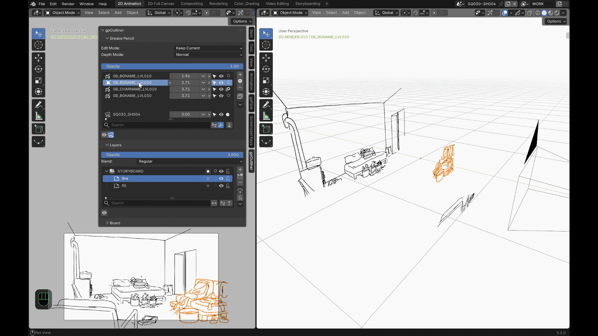
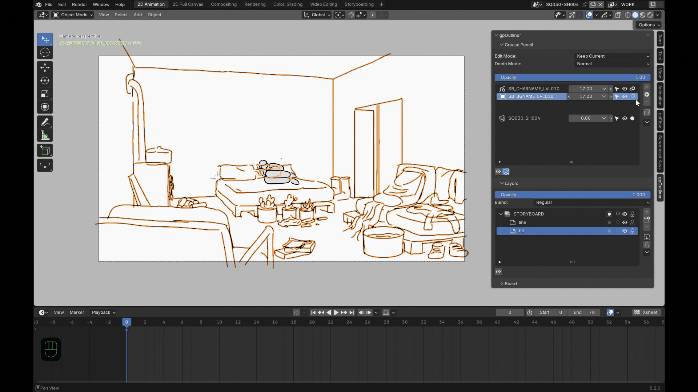

# Fonctionnalités

## Liste d'objets triée par profondeur

Triez vos objets Grease Pencil par distance à la caméra, pas seulement par
ordre alphabétique — aucun moyen natif de le faire dans Blender ;
gpOutliner la calcule en direct le long de l'axe de visée réel de la
caméra. Par défaut, l'objet le plus proche se retrouve en haut de la
liste, comme les calques d'un logiciel de dessin 2D. Un widget par ligne
permet de glisser horizontalement pour ajuster, d'utiliser les boutons
`<`/`>` pour ±1, ou de saisir une valeur exacte.

## Mode Depth

Deux façons de déplacer la profondeur d'un objet avec ce même widget :

- **Normal** — déplace simplement l'objet ; sa taille à l'écran change
  comme pour n'importe quel objet qui se rapproche ou s'éloigne de la
  caméra.
- **Compensate** — déplacez la profondeur et l'échelle de l'objet s'ajuste
  automatiquement pour garder sa taille apparente constante à l'écran, de
  quoi replacer un dessin dans l'espace 3D sans qu'il grossisse ou
  rétrécisse visuellement.

## Modes d'édition

Choisissez comment gpOutliner gère le mode d'édition en cours quand vous
changez l'objet Grease Pencil actif :

| Mode | Changer d'objet... |
|---|---|
| **Keep Current** (défaut) | ...garde le mode dans lequel vous étiez déjà (rester en mode Draw, par exemple). |
| **Remember Last** | ...restaure le dernier mode utilisé sur *cet* objet précisément, indépendamment pour chacun. |

## Opacité & isolation

- **Opacité globale par objet** — un curseur qui atténue tous les calques
  d'un dessin ensemble, en préservant leur opacité relative, plutôt que de
  devoir toucher chaque calque à la main. Chaque calque garde aussi sa
  propre opacité native et son propre mode de fusion, disponibles dans le
  même panneau Layers.
- **Isolation en un clic** — masquez tous les autres objets Grease Pencil,
  ou tous les autres calques de l'objet courant. Désactivez et tout revient
  exactement comme avant.

## Outils caméra

- **Liste de caméras optionnelle** dans le même panneau — visibilité,
  sélectabilité, bascule de caméra active, et positionnement rapide sur
  l'axe Z local.
- **Images de fond de caméra** — la pile d'images de fond native de
  Blender pour la caméra active, gérée depuis ce même panneau plutôt que
  depuis l'onglet Camera Properties : ajoutez une entrée, choisissez son
  image via l'icône de dossier, basculez sa visibilité, inversez si elle
  se dessine devant ou derrière les objets 3D, réordonnez la pile, et
  réglez l'opacité de l'entrée active.
- **Contrainte Child Of en un clic** — parente rigidement un dessin à la
  caméra active (une vraie contrainte Blender, juste appliquée et nommée
  pour vous).

## Boards (contextes de dessin 2D/3D)

Un **board** est une caméra dédiée à laquelle appartiennent un ou
plusieurs dessins, pour basculer tout le groupe à plat pour un dessin 2D
confortable et sans distorsion, puis revenir exactement à la mise en
scène 3D quittée — aucun recentrage, aucune distorsion, chaque autre objet
de la scène reste visuellement en place.

- Créez un board à partir d'une nouvelle caméra de référence (toujours
  initialisée en pose 2D plate), ou promouvez n'importe quelle caméra
  existante.
- **Align to 2D** et **Back to 3D** sont deux boutons séparés plutôt
  qu'une seule bascule : Align to 2D a besoin d'un board avec au moins un
  dessin pas déjà en pose 2D ; Back to 3D a besoin d'un alignement
  précédent à annuler, et se désactive si la caméra a été déplacée à la
  main depuis — restaurer effacerait sinon cette position manuelle. Le
  panneau indique aussi directement le statut 2D/3D actuel de la caméra,
  et affiche la raison chaque fois qu'un bouton est grisé.
- Le panneau d'un board liste ses dessins membres (ajoutez la sélection
  courante, retirez-en un à la fois) et sa **distance 2D** — à quelle
  distance le long de l'axe de vue se place le plan de dessin une fois
  aligné, réglable par board. Elle n'entre en jeu qu'au moment où vous
  alignez vraiment en 2D (ou créez une nouvelle caméra de référence, qui
  démarre déjà à cette distance).
- Changer de board change aussi la caméra active de la scène.

## Opérations de tracé intelligentes

- **Duplicate Special** garde le mode de dessin actif pendant la
  duplication.
- **Separate Special** fait passer une sélection directement dans un
  nouvel objet.
- **Move to Special** envoie les traits sélectionnés vers n'importe quel
  autre objet et calque, choisi dans une liste avec recherche.

## Duplication de structure

Un bouton "+" dédié près de la liste d'objets duplique la hiérarchie de
calques et de groupes d'un Grease Pencil existant sans copier le moindre
trait : choisissez n'importe quel objet de la scène comme source dans une
liste avec recherche (pas seulement l'objet actif), nommez le résultat, et
gpOutliner le duplique entièrement puis vide chaque calque jusqu'à une
seule frame vide à la tête de lecture — prêt pour un dessin neuf sur le
même rig — et bascule directement en mode Draw pour commencer.
