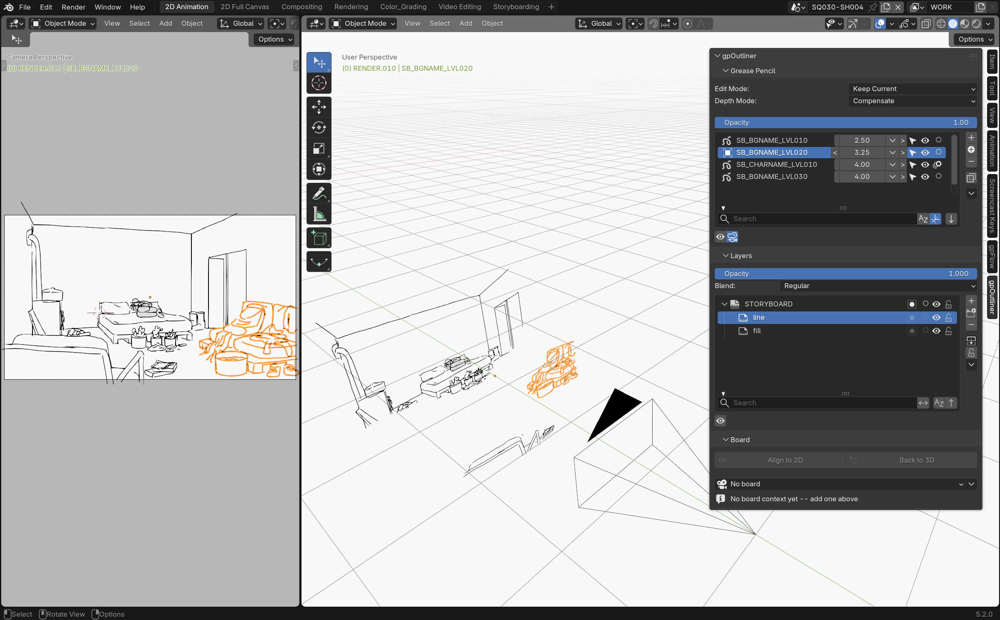

# gpOutliner

{: .addon-hero-logo }

**Un poste de commande dédié pour chaque objet Grease Pencil de la scène.**

gpOutliner ajoute un panneau unique à la vue 3D qui centralise la gestion
des objets Grease Pencil, de leurs calques et des caméras — plus proche de
l'ergonomie d'un logiciel de dessin 2D dédié, sans rien perdre de ce
qu'apporte la vue 3D. Il ne masque ni ne remplace jamais l'Outliner natif de
Blender, les Object Data Properties, ou les opérateurs Grease Pencil — il
met simplement les contrôles qu'on utilise sans arrêt juste là où on dessine
déjà.

## En un coup d'œil

- **Liste d'objets triée par profondeur** — triez vos objets Grease Pencil
  par distance à la caméra, les plus proches en haut, comme les calques
  d'un logiciel de dessin 2D — pas seulement par ordre alphabétique.
- **Mode Depth** — déplacez la profondeur d'un objet normalement, ou
  passez en Compensate pour garder sa taille apparente constante à l'écran
  pendant le déplacement.
- **Deux modes de synchro d'édition** — Keep Current (changer d'objet
  garde le mode courant) ou Remember Last (restaure le dernier mode
  utilisé sur chaque objet).
- **Opacité globale par objet** — un curseur qui atténue tous les calques
  d'un dessin ensemble, en préservant leur opacité relative.
- **Images de fond de caméra** — ajoutez, réordonnez et gérez des images de
  référence ou des rushes sur le fond de votre caméra, depuis le même
  panneau.
- **Isolation en un clic** — masquez tous les autres objets Grease Pencil,
  ou tous les autres calques de l'objet courant, d'un seul interrupteur.
- **Contrainte caméra Child Of en un clic** — une vraie contrainte Blender,
  appliquée et nommée pour vous.
- **Boards** — regroupez des dessins sous une caméra dédiée, basculez tout
  le groupe à plat pour un dessin 2D confortable, puis revenez exactement à
  la mise en scène 3D quittée, sans recentrage ni distorsion.
- **Opérations de tracé intelligentes** — Duplicate Special, Separate
  Special, et Move to Special.
- **Duplication de structure** — copiez toute la hiérarchie de calques d'un
  objet sans copier le moindre trait.

Voir la page **[Fonctionnalités](features.md)** pour une démonstration
complète en images.

## Pourquoi ça reste natif

gpOutliner n'invente jamais un système parallèle là où Blender en a déjà
un : la gestion des calques passe par le widget natif et les opérateurs de
Blender, la contrainte caméra est une vraie contrainte Blender (juste
appliquée et nommée pour vous), et rien ici ne verrouille l'Outliner natif
ou l'éditeur Properties. Seules les zones où Blender n'offre pas de
solution directe — tri par profondeur, compensation d'échelle visuelle,
mise en scène 2D via les Boards, opacité globale multiplicative —
reçoivent du code dédié.

Nécessite **Blender 5.2 ou plus récent**.

## Licence

[GNU General Public License v3.0 ou ultérieure](https://www.gnu.org/licenses/gpl-3.0.html)
— SPDX : `GPL-3.0-or-later`.

gpOutliner fait partie de la suite **[SlateFlow](../index.md)**.

## Support

slateFlow est développé sur mon temps libre, en parallèle d'une activité
d'indépendant. Les prix sont volontairement accessibles : en échange, je ne
peux pas m'engager sur des délais de correctifs ou des développements sur
demande. Les retours et les idées sont les bienvenus — les bugs les plus
importants seront corrigés, et les bonnes idées feront leur chemin. Merci de
votre compréhension.

Trouvé un bug ? Voir [Signaler un bug](../index.md#signaler-un-bug) pour
savoir quoi inclure.
