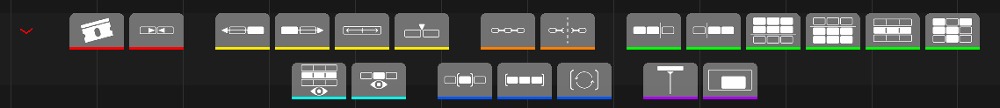

# Fonctionnalités

Chaque section ci-dessous est taguée **LITE** et/ou **PRO**. Voir
[LITE et PRO](index.md#lite-et-pro) pour le détail complet des niveaux.

## Barre d'outils contextuelle — LITE et PRO

Dessinée directement dans le VSE, sans fouiller dans les menus. Chaque
bouton ci-dessous a aussi son propre raccourci clavier — voir
[Préférences & raccourcis](shortcuts.md) pour la liste complète.

- **Cut** coupe chaque strip sélectionné à la tête de lecture. Sur un
  strip SCENE (un plan storyFlow par exemple), un split natif laisserait
  les deux moitiés partager la **même** scène sous-jacente — Cut donne à
  la moitié de droite une copie complète à la place, pour que chaque
  moitié soit indépendante dès le départ.
- **Join** ne fonctionne que sur des strips qui se touchent vraiment,
  même canal, même type, même fichier source — en pratique, ça annule un
  Cut. Ça ne fusionne pas deux plans différents.
- **Swap** (left/right) échange un strip, ou tout un bloc de plusieurs
  strips sélectionnés qui se touchent sur le même canal, avec son unique
  voisin non sélectionné de ce côté. Le bloc se déplace comme un seul
  élément rigide ; un strip connecté à un autre (voir
  [Connexions de strips](#connexions-de-strips-lite)) est entraîné même
  si seul son partenaire était sélectionné.
- **Slip** invoque l'outil Slip natif de Blender.
- **Insert** (PRO) dépose la plage in/out d'une source — éditée dans le
  Source Viewer ou dans le Dual Monitor, voir
  [Source Viewer](#source-viewer-pro) — à la tête de lecture.
- **Connect / Disconnect** — voir [Connexions de strips](#connexions-de-strips-lite).
- **Sélections avancées** :

  | Action | Sélectionne |
  |---|---|
  | Select channel | Tous les strips qui partagent un canal avec la sélection actuelle |
  | Select above / below | Tous les strips de n'importe quel canal au-delà du plus haut/bas de la sélection — pas juste le suivant |
  | Navigate next/previous | Le strip suivant ou précédent dans le temps, en déplaçant la tête de lecture à son début |
  | Selection sets | Enregistre, rappelle ou supprime une sélection nommée |

  Les jeux de sélection sont retrouvés par nom, type, position et canal —
  si un strip a depuis été déplacé ou renommé, le rappel signale une
  restauration partielle plutôt que de deviner.
- **Isolate** — deux bascules indépendantes et réversibles, toutes deux
  basées sur le mute (donc elles affectent aussi l'audio, pas seulement ce
  qui est visible) :

  | Bouton | Coupe |
  |---|---|
  | Isolate Channel | Tous les canaux sauf ceux que touche la sélection actuelle |
  | Isolate Selection | Tous les strips qui ne sont pas actuellement sélectionnés |

  Recliquez sur le même bouton pour restaurer exactement l'état d'avant.

- **Frame range, Follow playhead et Minimap** sont les éléments divers de
  la toolbar, regroupés visuellement ensemble. Frame range règle la plage
  de lecture/rendu de la **scène**, pas juste la vue : Range Selected et
  Range All la cadrent une fois, Auto Range la recadre en continu sur la
  sélection actuelle. Follow playhead fait défiler la vue pendant la
  lecture pour garder la tête de lecture dans une zone confortable
  (25–40% de la largeur visible), au lieu de sauter ou d'exiger un
  recentrage manuel. Minimap (PRO) bascule simplement l'affichage de la
  [minimap de la timeline](#minimap-de-la-timeline-pro).

## Connexions de strips — LITE

Une connexion est un lien partagé et invisible entre des strips liés —
typiquement un plan vidéo et son son — pour que glisser, échanger (swap)
ou exporter l'un entraîne l'autre. **Connect**/**Disconnect** sur la
toolbar l'appliquent à la sélection actuelle.

Les connexions ne sont pas détectées passivement — le panneau
**Connection Tools** et son **Conditional Connect** pilotent ça
explicitement, en combinant des critères appliqués en un clic :

| Condition | Regroupe les strips qui... |
|---|---|
| Selected strips only | ...sont limités à la sélection actuelle (activé par défaut — désactivez pour scanner toute la timeline) |
| Same start frame | ...démarrent exactement à la même frame |
| Same end frame | ...se terminent exactement à la même frame |
| Same channel | ...sont sur le même canal |
| Same length | ...partagent la même durée |
| Movie-sound pairs | ...ressemblent à une paire vidéo+audio correspondante, par le nom |

N'importe quelle combinaison peut être cochée à la fois — un strip doit
satisfaire chaque condition cochée pour rejoindre un groupe. Le cas
courant consiste à ne garder que **Movie-sound pairs** coché. Le
même panneau liste aussi chaque groupe de connexion existant, avec un
bouton pour sélectionner tout le groupe d'un coup.

Principalement là pour préparer un aller-retour d'export :
**[sequencerOTIO](../sequencerOTIO/index.md)** (un autre addon SlateFlow)
lit ces liens pour garder les paires vidéo/audio ensemble à l'export vers
Resolve via OpenTimelineIO.

## Guides de zones — LITE et PRO

Des lignes de séparation colorées sur une plage de canaux (audio, vidéo,
effets...), réglables dans le panneau N **Zone Guides**.

- **Show Zone Guides** / **Lock** affichent ou masquent l'overlay ; Lock
  gèle les limites contre le glisser dans le VSE sans les cacher.
- **La liste des zones** : cliquer le nom d'une zone en fait la zone
  active (éditable juste en dessous). Sa plage de canaux est affichée en
  lecture seule — pas de champ pour la taper directement. Pour la
  changer : glissez une limite dans le VSE (clic-glisser sur la ligne
  colorée près du **bord gauche de la timeline visible** — c'est le seul
  endroit où c'est possible, pas n'importe où sur la ligne ; aucune
  touche requise, Échap annule), ou utilisez ▲/▼, Add Zone, Reset ou un
  preset.
- **▲ / ▼** n'insèrent pas la zone ailleurs dans la liste : ils
  **échangent sa place** avec la zone voisine, chacune gardant sa taille,
  son nom et sa couleur.
- **+ Add Zone** ajoute une nouvelle zone juste au-dessus de la dernière.
- La boîte du dessous édite le **nom** et la **couleur** de la zone
  active.
- **Drag Mode** règle ce qui arrive aux autres zones quand une limite
  bouge :

  | Mode | Effet |
  |---|---|
  | **Adjust** (défaut) | Seule la zone voisine directement touchée suit — les autres restent fixes. |
  | **Push** | Le reste de la pile dans cette direction se décale en conséquence, comme un accordéon. |

- **Presets** enregistrent la disposition actuelle sous un nom, la
  rappellent ou la suppriment.

!!! info "Par scène"
    Zones et presets sont propres à chaque scène, pas au fichier entier —
    une autre scène (ou le Source Viewer) a sa propre configuration.

## Renommage en lot & synchro de scène — LITE

Le panneau N **Name Tools** renomme une sélection ou toute la timeline
(**Find/Replace**, ou **Set Name** avec un préfixe/suffixe optionnel — le
suffixe peut à la place s'auto-numéroter, dans l'**ordre de la
timeline**, pas l'ordre de sélection). Un aperçu en direct montre ce que
deviendrait le premier strip concerné.

Renommer un strip SCENE renomme aussi automatiquement sa scène
sous-jacente pour correspondre. **Sync Scene Names** réapplique cette
même synchro strip→scène à la demande, sans rien renommer d'abord.

## Export de segments — LITE

Le panneau N **Export Tools** rend la timeline en un fichier vidéo par
segment — pas "chaque strip sélectionné", et sans mixdown audio séparé
(chaque strip son non muet dans la plage d'un segment est automatiquement
mixé dans la vidéo de ce segment).

- **Export Range (In/Out)** est la même plage que
  [Frame range](#barre-doutils-contextuelle-lite-et-pro) ci-dessus,
  réaffichée ici puisqu'elle pilote l'export.
- Une coupure n'est posée que là où le **strip visible le plus haut**
  change réellement — les strips empilés dessous ne forcent pas chacun
  leur propre coupure. Le panneau affiche en direct le nombre de segments
  que ça produirait.
- **Naming** (nommage) :

  | Mode | Nom du segment basé sur... |
  |---|---|
  | **Topmost Strip** (par défaut) | Le strip le plus haut dans ce segment |
  | **Custom Pattern** | Un nom de base + préfixe/suffixe/numérotation — même moteur que le Renommage en lot |

  Un suffixe de numéro de frame s'ajoute par-dessus dans les deux cas,
  comme vrai garde-fou anti-collision (un strip peut redevenir le plus
  haut plus tard) : désactivé, un compte de durée `0001-NNNN`, ou les
  vrais numéros de frame de la **Timeline**.
- Le rendu utilise les **Output Properties** propres à la scène (format,
  codec, chemin) — pas de sélecteur de format séparé ici. Le panneau
  avertit si le chemin de sortie est encore celui par défaut de Blender,
  signe fréquent que ces réglages ont été faits sur un autre onglet de
  scène.

## Courbes sur les strips — PRO

Des courbes de volume et d'opacité dessinées directement sur les strips —
pas besoin d'ouvrir le Graph Editor :

- **Ctrl+clic** n'importe où sur un strip ajoute une clé à cet endroit.
- **Clic-glisser** une clé existante pour la déplacer.
- **Double-clic** sur une clé ouvre sa Frame/Value exacte pour édition
  directe.

Ces courbes pilotent de vraies F-Curves Blender sur les propriétés
`volume` ou `blend_alpha` du strip — ouvrir le Graph Editor sur le même
strip montre les mêmes clés.

## Source Viewer — PRO

Un vrai montage 3 points dans Blender, via deux façons interchangeables de
prévisualiser une source :

- **Scène dédiée** : le Source Viewer classique — posez des points IN/OUT
  sur n'importe quel plan dans sa propre scène, votre scène de montage
  restant intacte pendant que vous parcourez les rushs.
- **Dual Monitor** : une seconde prévisualisation indépendante (construite
  sur le Movie Clip Editor) avec sa propre tête de lecture, image et son —
  vraiment simultanée avec le montage principal, pas une bascule entre
  les deux.

Double-cliquer un fichier dans le File Browser (ou le glisser-déposer) va
toujours vers celui qui est actuellement actif : dans le **Dual Monitor**
si une zone Clip Editor est configurée pour l'afficher, sinon dans la
**scène dédiée** classique. Un historique de médias et des points IN/OUT
partagés fonctionnent dans les deux — basculez de l'un à l'autre sans
perdre votre position. Avant de charger quoi que ce soit, l'overlay
**Folder Media Info** affiche un tableau comparatif (fps, résolution,
durée, profil couleur) directement dans le File Browser, pour comparer
des fichiers candidats sans en ouvrir aucun au préalable.

Le Dual Monitor ajoute quelques éléments propres : ses propres raccourcis
**I**/**O** pour poser in/out directement dans le Clip Editor, un bouton
**Reset In/Out**, une bascule d'affichage du timecode, et le système
natif de Blender de génération de proxy par clip (25/50/75/100%, qualité
réglable) — un proxy à 50% est construit et activé automatiquement en
arrière-plan pour chaque nouveau clip chargé, pour que le scrubbing reste
fluide sans avoir à le configurer à la main.

Dans les deux cas, **Insert** dépose la plage in/out sélectionnée à la
tête de lecture, en décalant automatiquement tous les plans suivants.

## Contrôle de vitesse — PRO

Un petit badge **s** à côté de l'icône d'opacité sur chaque strip
retimable (pas les strips d'effet — SOUND inclus, pour qu'une paire
vidéo+audio connectée puisse être retimée ensemble), coloré gris/bleu/
violet pour normal/réglé/figé. Cliquez-le pour le dialogue **Set Speed** :
un **pourcentage** (100 = normal, 50 = demi-vitesse, 200 = double), ou
**Freeze Frame** pour figer le point d'entrée à la place.

Les deux pilotent les vrais opérateurs de retiming natifs de Blender —
jamais un modèle de vitesse parallèle. Le facteur est aussi écrit sur le
strip (`strip["otio_speed"]`) pour que
**[sequencerOTIO](../sequencerOTIO/index.md)** puisse le reporter à
l'export.

## Audio avancé — PRO

- Un **VU-mètre** en temps réel (niveau en dB plus le pic depuis la
  dernière réinitialisation), ancré à gauche du VSE — pas de contrôle
  dans l'interface pour le déplacer.
- Chaque strip son reçoit un **badge de canal** qui montre son format
  réel en un coup d'œil (Mono / Stereo / 5.1 / 7.1).
- Cliquez un badge pour forcer ce strip en **mono**, avec son propre pan
  **Left / Center / Right**.

## Minimap de la timeline — PRO

Une vue d'ensemble 2D (temps × canaux) de toute la timeline dans un
panneau de taille fixe en coin — une silhouette par strip, colorée
d'après son propre tag de couleur ou la couleur native de son type, plus
un cadre indiquant la zone actuellement visible. Cliquez ou glissez pour
recentrer la vue principale à cet endroit.
