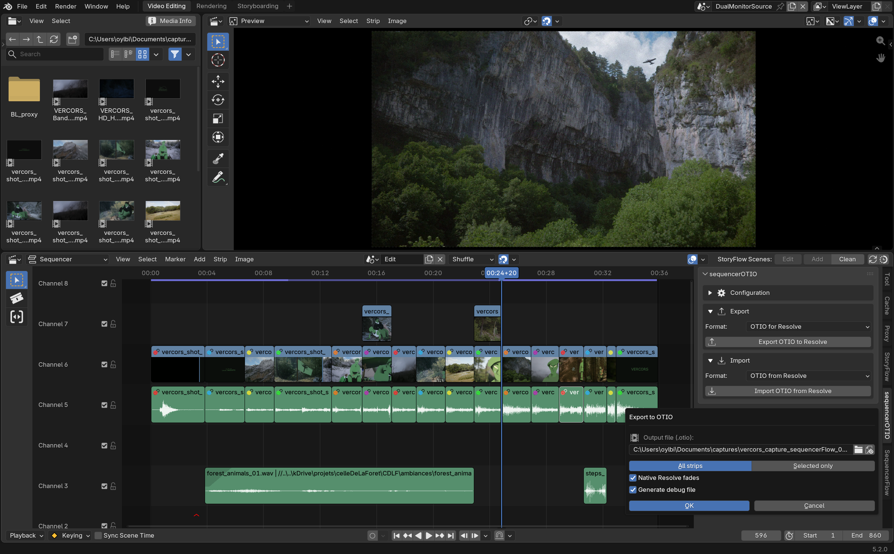

# Export

Transforme le montage VSE actuel en un fichier `.otio` calibré pour Resolve,
depuis le panneau **OTIO** du panneau latéral du Sequencer.

## Ce qui est conservé

- **Une piste OTIO par canal Blender réellement utilisé** — canaux vides
  compris, pour que la disposition des pistes survive à l'aller-retour. Le
  canal vidéo le plus bas de Blender devient `Video 1` ; l'ordre des canaux
  audio est inversé pour correspondre à l'empilement de Resolve.
- **Les clés d'animation volume/opacité** conservées comme courbes de
  Bézier, jamais aplaties.
- **Les fondus purs** en bord de plan (opacité/volume qui descend à zéro)
  convertis en transitions/fondus audio natifs de Resolve plutôt qu'en clés
  brutes — optionnel, activé par défaut, pour qu'un monteur qui récupère la
  timeline dans Resolve ait de vraies poignées de fondu, pas un tas de clés à
  décoder.
- **Changements de vitesse et freeze frames** encodés en `TimeEffect` OTIO.

## Portée

Exportez soit **toute la timeline**, soit juste la **sélection actuelle** —
pratique pour confier une séquence précise sans exporter le montage entier
d'un projet.

## Rapports de debug

Chaque export dépose un rapport de debug à côté du fichier `.otio` et le
charge directement dans l'éditeur de texte de Blender, pour voir exactement
ce qui a été écrit sans fouiller dans un log caché.

!!! info "Chemins et reliaison des médias"
    Si une source média référencée par le montage se trouve hors du dossier
    d'export, Resolve peut ne pas la relier automatiquement — l'export vous
    avertit (rapport de debug + popup) quand ça arrive, pour que vous sachiez
    qu'il faut relier manuellement ou réexporter avec le média à côté.
