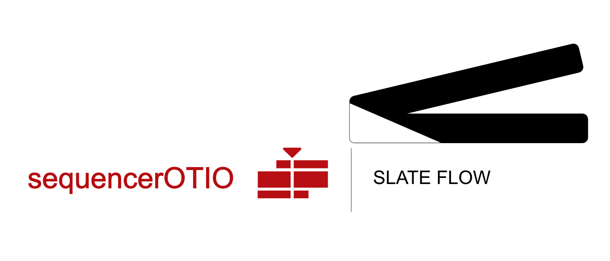

# sequencerOTIO

{: .addon-hero-logo }

**Un aller-retour propre entre le VSE de Blender et DaVinci Resolve.**

sequencerOTIO est une porte de sortie professionnelle hors du Video Sequence
Editor de Blender, construite sur **OpenTimelineIO (OTIO)** — le format
d'échange ouvert aussi utilisé par Resolve, Nuke Studio, Premiere et
d'autres. Il existe pour les étapes de production que le VSE de Blender ne
couvre pas bien (vrai mixage audio, exports finaux prêts pour DCP) sans
enfermer votre montage dans Blender : coupez dans le VSE, confiez la
timeline à Resolve, récupérez les changements, continuez à monter dans
l'un ou l'autre outil.

Il ne réimplémente jamais les fonctionnalités de Resolve dans Blender et ne
garde jamais de copie parallèle de votre montage — c'est une couche de
traduction qui lit et écrit les données natives du VSE (strips, F-Curves,
retiming) à la sortie, et les mêmes données natives du VSE au retour.

<video controls muted playsinline style="max-width: 100%;">
  <source src="assets/sequencerOTIO_all_01.mp4" type="video/mp4">
</video>

## En un coup d'œil

- **Export** du montage VSE actuel vers un fichier `.otio` calibré pour
  Resolve — disposition complète des pistes, courbes, fondus, changements de
  vitesse.
- **Import** d'un `.otio` venant de Resolve, en mode **Add**, **Replace** ou
  **Conform**.
- **Conform** : compare le montage *vivant* de Blender à l'export Resolve,
  classe chaque plan (inchangé / déplacé / retrimé / split / modifié /
  nouveau / supprimé), et applique seulement les changements — rien n'est
  réimporté à l'aveugle.
- **Mise en place quasi nulle** : la dépendance Python (`opentimelineio`)
  s'installe toute seule au premier chargement, depuis une wheel embarquée,
  sans connexion internet nécessaire dans la plupart des cas.

Voir **[Export](export.md)**, **[Import & conform](import.md)** et
**[Configuration](configuration.md)** pour le détail complet.

## Pourquoi c'est sûr de confier le montage et de le récupérer

- **Conform fait un diff plutôt qu'un écrasement** — récupérer un export
  Resolve n'écrase jamais le travail fait dans Blender depuis l'export.
- **Des rapports de debug réellement lisibles** — chaque export/import dépose
  un rapport de debug à côté du fichier `.otio` et le charge directement dans
  l'éditeur de texte de Blender.
- **Rien ne sort du modèle de données du VSE** — volume, opacité, transform
  et retiming font tous l'aller-retour via les vraies propriétés de strip et
  les F-Curves de Blender. Désactivez l'addon : votre montage est exactement
  ce que Blender lui-même y a mis.

Nécessite **Blender 5.0 ou plus récent** (5.2 LTS recommandé).

## Licence

[GNU General Public License v3.0 ou ultérieure](https://www.gnu.org/licenses/gpl-3.0.html)
— SPDX : `GPL-3.0-or-later`.

sequencerOTIO fait partie de la suite **[SlateFlow](../index.md)**.

## Support

Ce projet est développé à son propre rythme, sur le temps libre de son
auteur. Il est fourni **en l'état**, sans garantie.

Un bug à signaler, une suggestion ? Utilisez le canal de support indiqué
sur votre page d'achat — chaque message est lu, mais sans garantie de délai
de réponse.
