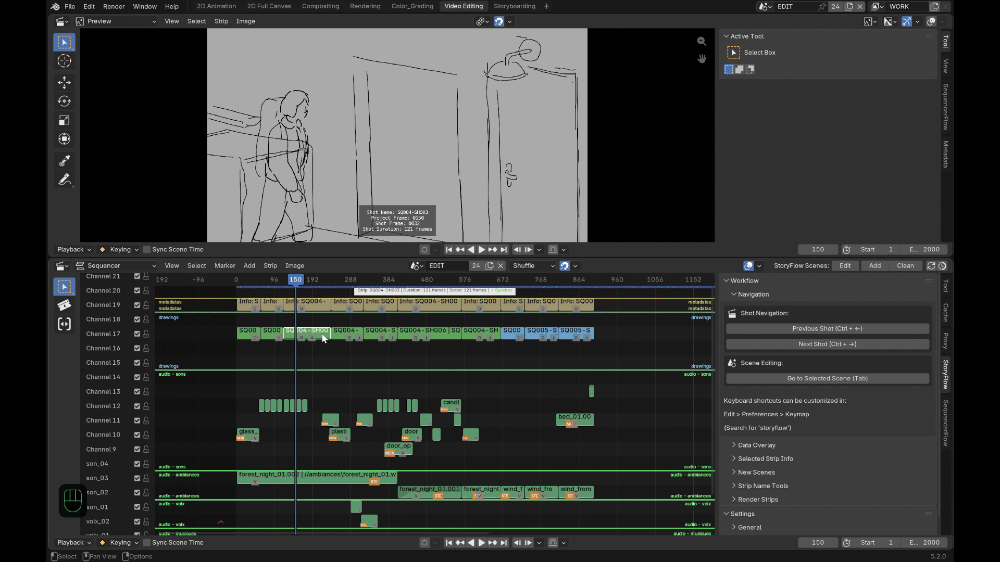

# Fonctionnalités

## Navigation

- **Tab** bascule entre le plan sélectionné et sa scène de dessin, en
  atterrissant à la *frame* correspondante dans les deux sens — pas juste un
  changement de scène. Tab bascule aussi entre les deux workspaces réglés
  dans le panneau **Settings > General** ("Video Editing" et "2D Animation"
  par défaut, mais n'importe quelle paire de workspaces fonctionne), et
  pointe le Sequencer intégré du workspace de dessin vers la scène de
  montage principale (utile si dans votre template pour les scènes
  d'animation vous avez le VSE présent).
- **Ctrl+Alt+←/→** se déplace entre les clés d'animation du plan courant avant de passer au plan suivant ou précédent quand ils sont atteints.
- **Alt+←/→** se déplace entre les scènes de dessin, sans quitter le
  contexte de dessin.

## Synchro des durées, dans les deux sens

Redimensionnez la plage d'une scène de dessin et son strip dans le montage est aussi modifié ;
redimensionnez le strip et c'est la scène de dessin qui est modifiée.

Trois façons explicites d'étendre ou de rétrécir un plan dans le montage :

- **Par défaut** (glisser une poignée, ou double-clic sans cocher l'option) :
  rogne le plan voisin quand ça se chevauche.
- **Ctrl maintenu** pendant le glisser : pousse tous les plans suivants (ou précédents), sur tous
  les canaux, au lieu de rogner.
- **double clic sur une poignée** ouvre une popup pour ajouter ou retirer des frames, avec la possibilité ici aussi de pousser/tirer les plans qui suivent ou précèdent, selon les besoins.

## Protection des scènes partagées

Si deux plans finissent par pointer vers la même scène de dessin — un
copier/coller entre fichiers, une réassignation manuelle de scène — un
**marqueur rouge** apparaît directement sur les deux strips pour que ça ne
passe pas inaperçu. Tant que le partage dure, l'édition des points in/out
des plans concernés (ou de la durée de la scène de dessin elle-même) est
verrouillée pour éviter de corrompre silencieusement l'un des deux plans ;
le verrou se lève tout seul dès que le partage est résolu.

## Un overlay en direct sur le plan sélectionné

Un petit overlay à l'écran affiche le nom et la durée du plan sélectionné en
un coup d'œil dans le VSE, sans ouvrir de panneau latéral — et si plusieurs
plans sont sélectionnés, il affiche aussi combien.

## Le son suit l'image

L'audio qui chevauche un plan est copié automatiquement dans sa scène de
dessin, repositionné correctement, pitch/pan/volume/vitesse préservés — vous
pouvez entendre le timing en dessinant sans aucune copie manuelle. Les
pistes audio mises en muet peuvent être exclues de cette copie.

## Métadonnées incrustées sur l'image

storyFlow peut incruster des métadonnées directement sur l'image. Chaque
information ci-dessous a son propre interrupteur, pour choisir exactement
lesquelles afficher plutôt que de les avoir toutes d'un coup ou aucune :

- Nom du plan.
- Numéro de frame relatif au projet.
- Numéro de frame relatif au plan (départ à 0 ou à 1, au choix).
- Durée.
- Marqueurs de début/fin.

## Outils de production

Au-delà du flux quotidien, storyFlow couvre aussi l'intendance d'une vraie
production :

- **Ajouter**, un plan ou plusieurs d'un coup — deux comportements
  différents selon ce qui est sélectionné :
  - **Un plan est sélectionné** : le nouveau atterrit juste après, nommé
    en incrémentant le numéro trouvé à la fin du nom du plan
    sélectionné — les options de nommage du panneau latéral sont
    complètement ignorées sur ce chemin.
  - **Rien n'est sélectionné** : le nouveau plan est nommé à partir du nom
    de base/préfixe/suffixe du panneau latéral, et une popup permet en
    plus de le placer à la tête de lecture ou en fin de timeline, de
    choisir son canal, et de régler combien en ajouter d'un coup.

  Dans les deux cas, chaque plan créé est sa propre scène indépendante.

- **Renommage par lot**, sur la sélection ou toute la timeline : soit
  chercher/remplacer dans les noms existants, soit poser un nouveau nom de
  base avec un préfixe optionnel et un suffixe — ce suffixe est soit un
  texte fixe que vous définissez, soit une numérotation automatique à la
  place, numérotée dans l'ordre de la timeline (pas de la sélection) pour
  que la séquence reste toujours lisible.
- **Nettoyer les scènes de dessin inutilisées** en un clic, avec une
  protection par scène pour tout ce que vous voulez garder quand même.
- **Rendre directement depuis la timeline**, découpé en **segments** là où
  le strip visible au canal le plus haut change réellement — pour que des
  plans volontairement superposés sur plusieurs canaux se rendent
  correctement au lieu qu'un seul ne gagne silencieusement pour toute sa
  durée d'origine. Choisissez un format vidéo (FFmpeg) et chaque segment
  se rend en un seul fichier vidéo ; choisissez n'importe quel format
  image (y compris les formats multi-couches comme OpenEXR — ça reste du
  rendu "image", pas un troisième mode) et des options supplémentaires
  apparaissent : un espacement minimum entre les *vraies* images-clés du
  dessin (objets, Grease Pencil, NLA, marqueurs de scène) plutôt qu'un
  intervalle fixe, une numérotation en frame réelle ou consécutive, et un
  sous-dossier dédié par segment en option. Dans tous les cas, les
  segments sont nommés soit d'après le strip au canal le plus haut, soit
  avec votre propre schéma préfixe/suffixe/numérotation (mêmes options que
  le renommage en lot), plus un suffixe de plage de frames en garde-fou
  anti-collision, et le résultat peut être réinjecté dans la timeline
  comme nouveaux strips automatiquement.
